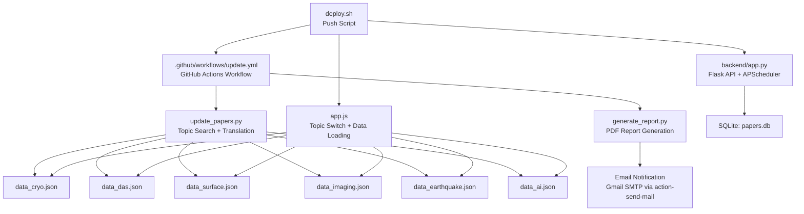
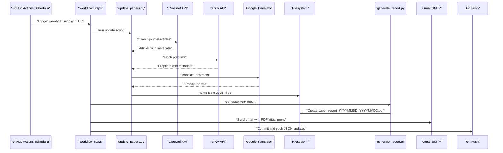
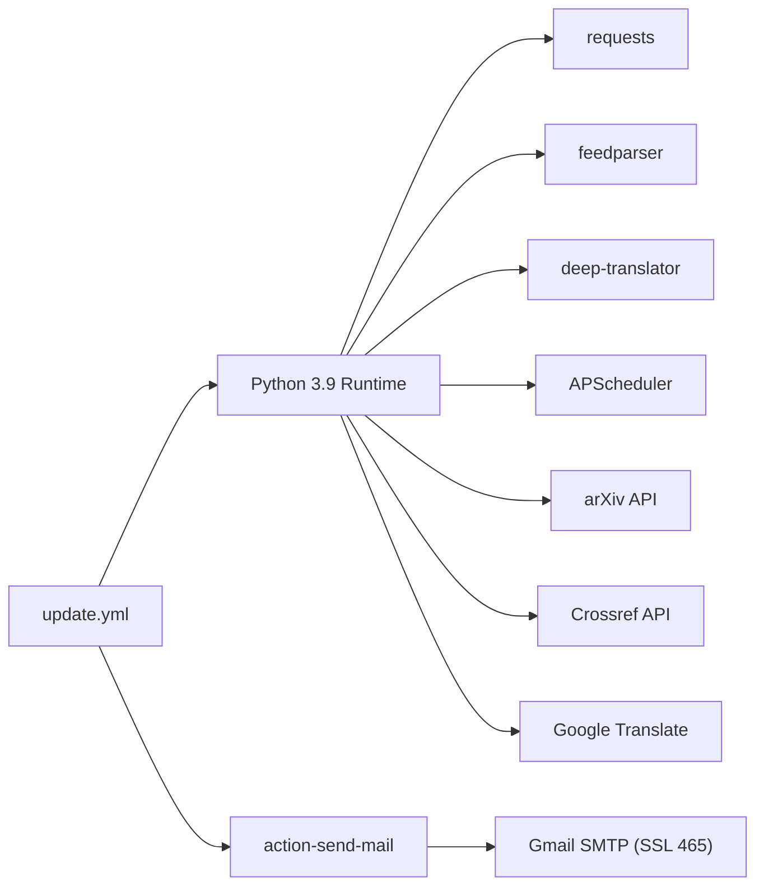

# Configuration Guide

<cite>
**Referenced Files in This Document**
- [update.yml](file://.github/workflows/update.yml)
- [update_papers.py](file://update_papers.py)
- [app.js](file://app.js)
- [backend/app.py](file://backend/app.py)
- [generate_report.py](file://generate_report.py)
- [requirements.txt](file://requirements.txt)
- [deploy.sh](file://deploy.sh)
- [README.md](file://README.md)
- [test_mail.py](file://test_mail.py)
- [email_body.txt](file://email_body.txt)
- [data_cryo.json](file://data_cryo.json)
- [data_das.json](file://data_das.json)
- [data_surface.json](file://data_surface.json)
- [data_imaging.json](file://data_imaging.json)
- [data_earthquake.json](file://data_earthquake.json)
- [data_ai.json](file://data_ai.json)
</cite>

## Update Summary
**Changes Made**
- Updated PDF report generation system to use English topic names and numeric date formatting throughout the internationalization effort
- Enhanced Unicode support with DejaVu font fallback and ASCII-only character processing for improved PDF rendering
- Maintained backward compatibility with existing Chinese topic names in JSON data files while ensuring English display in reports
- Updated GitHub Actions workflow to handle mixed-language content in email notifications

## Table of Contents
1. [Introduction](#introduction)
2. [Project Structure](#project-structure)
3. [Core Components](#core-components)
4. [Architecture Overview](#architecture-overview)
5. [Detailed Component Analysis](#detailed-component-analysis)
6. [Dependency Analysis](#dependency-analysis)
7. [Performance Considerations](#performance-considerations)
8. [Troubleshooting Guide](#troubleshooting-guide)
9. [Conclusion](#conclusion)
10. [Appendices](#appendices)

## Introduction
This guide documents the configuration of the paper_weekly system, covering GitHub Actions automation, email notifications, topic configuration for seismology areas, deployment options, and operational security and monitoring practices. The system has been updated to use English interface labels, numeric date formatting, and English topic classifications throughout the application with enhanced Unicode support and ASCII-only character processing for PDF generation. It is designed for both administrators and developers who need to set up, customize, and maintain the system.

## Project Structure
The repository organizes configuration and automation around a clear separation of concerns:
- GitHub Actions workflow orchestrates periodic updates, email notifications, and Git commits.
- Python scripts handle topic-based paper discovery, translation, and JSON output.
- Frontend JavaScript renders topic-specific datasets and displays paper details.
- Backend Flask service provides an API for search, persistence, and analysis.
- Deployment and testing utilities support local development and CI/CD.

**Diagram sources**
- [update.yml:1-61](file://.github/workflows/update.yml#L1-L61)
- [update_papers.py:1-217](file://update_papers.py#L1-L217)
- [generate_report.py:1-129](file://generate_report.py#L1-L129)
- [app.js:1-148](file://app.js#L1-L148)
- [backend/app.py:1-236](file://backend/app.py#L1-L236)
- [deploy.sh:1-34](file://deploy.sh#L1-L34)

**Section sources**
- [update.yml:1-61](file://.github/workflows/update.yml#L1-L61)
- [update_papers.py:1-217](file://update_papers.py#L1-L217)
- [generate_report.py:1-129](file://generate_report.py#L1-L129)
- [app.js:1-148](file://app.js#L1-L148)
- [backend/app.py:1-236](file://backend/app.py#L1-L236)
- [deploy.sh:1-34](file://deploy.sh#L1-L34)

## Core Components
- GitHub Actions workflow: schedules weekly runs, installs dependencies, executes the update script, generates PDF reports, sends email notifications, and pushes changes.
- Topic configuration: defines six seismology topics with English names, keywords, and output files.
- Frontend topic switching: maps topic identifiers to JSON data files and renders lists with metadata.
- Backend API: exposes endpoints for search, retrieval, and analysis; persists results to SQLite; includes a background scheduler.
- Deployment: automated push script and README guidance for site integration with Hexo.

**Section sources**
- [update.yml:1-61](file://.github/workflows/update.yml#L1-L61)
- [update_papers.py:42-84](file://update_papers.py#L42-L84)
- [app.js:4-11](file://app.js#L4-L11)
- [backend/app.py:175-218](file://backend/app.py#L175-L218)
- [README.md:14-39](file://README.md#L14-L39)

## Architecture Overview
The system operates on a periodic schedule orchestrated by GitHub Actions. The update script performs topic-based searches across Crossref and arXiv, translates abstracts, and writes structured JSON files. The frontend loads topic-specific data and displays summaries. The backend provides an API for programmatic access and analysis.

**Diagram sources**
- [update.yml:3-60](file://.github/workflows/update.yml#L3-L60)
- [update_papers.py:194-217](file://update_papers.py#L194-L217)
- [generate_report.py:118-129](file://generate_report.py#L118-L129)
- [email_body.txt:1-74](file://email_body.txt#L1-L74)

## Detailed Component Analysis

### GitHub Actions Workflow Configuration
- Scheduling: Runs weekly at midnight UTC using cron syntax.
- Manual trigger: Allows manual execution via the GitHub UI.
- Environment:
  - Uses Ubuntu runner and Python 3.9.
  - Installs dependencies including requests, feedparser, deep-translator, and fpdf.
- Job steps:
  - Checkout repository.
  - Set up Python.
  - Install dependencies.
  - Run the update script.
  - Generate PDF report with numeric date formatting.
  - Send email notification via action-send-mail with Gmail SMTP (SSL port 465).
  - Commit and push changes with a timestamped message.

Key configuration points:
- Schedule: [update.yml:4-5](file://.github/workflows/update.yml#L4-L5)
- Dependencies installation: [update.yml:20-22](file://.github/workflows/update.yml#L20-L22)
- PDF generation: [update.yml:27-28](file://.github/workflows/update.yml#L27-L28)
- Date range calculation: [update.yml:30-37](file://.github/workflows/update.yml#L30-L37)
- Email notification: [update.yml:39-51](file://.github/workflows/update.yml#L39-L51)
- Commit and push: [update.yml:53-61](file://.github/workflows/update.yml#L53-L61)

**Section sources**
- [update.yml:1-61](file://.github/workflows/update.yml#L1-L61)

### Email Notification System (Gmail SMTP)
- SMTP settings: Host, port, and SSL enabled.
- Authentication: Username and password from repository secrets.
- Recipients: From-to addresses configured via secrets.
- Message composition: Subject, sender, body file, and PDF attachment.

Security and troubleshooting:
- Application password requirement for Gmail accounts with 2FA enabled.
- YAML configuration must set secure mode and port 465.
- Test script included for validating login and sending a test email.

Operational details:
- SMTP host/port and secure flag: [update.yml:40-44](file://.github/workflows/update.yml#L40-L44)
- Credentials from secrets: [update.yml:45-46](file://.github/workflows/update.yml#L45-L46)
- Body file and attachment: [update.yml:49-51](file://.github/workflows/update.yml#L49-L51)
- Troubleshooting guidance: [README.md:26-32](file://README.md#L26-L32)
- Test script: [test_mail.py:1-37](file://test_mail.py#L1-L37)

**Section sources**
- [update.yml:39-51](file://.github/workflows/update.yml#L39-L51)
- [README.md:26-32](file://README.md#L26-L32)
- [test_mail.py:1-37](file://test_mail.py#L1-L37)

### Topic Configuration System and Customization
The system defines six topics, each with an English name, a keyword list, and an output JSON filename. The update script iterates through topics, searches Crossref and arXiv, merges results, sorts by publication date, and writes a structured JSON file containing last update timestamp, topic name, and a list of papers.

Customization options:
- Modify keywords per topic to refine search scope.
- Adjust max results per source to balance freshness vs. comprehensiveness.
- Add or remove topics by extending the TOPICS dictionary.
- Change output filenames to integrate with different frontend routing.

Data model:
- Each paper includes identifier, title, URL, first author, correlation author placeholder, affiliation, translated abstract, source, and published date.
- JSON structure includes topic metadata and paper entries.

References:
- Topic definitions: [update_papers.py:42-84](file://update_papers.py#L42-L84)
- Crossref search: [update_papers.py:111-170](file://update_papers.py#L111-L170)
- arXiv search: [update_papers.py:172-192](file://update_papers.py#L172-L192)
- Output structure: [update_papers.py:209-216](file://update_papers.py#L209-L216)
- Example data files: [data_cryo.json:1-5](file://data_cryo.json#L1-L5), [data_das.json:1-5](file://data_das.json#L1-L5), [data_surface.json:1-5](file://data_surface.json#L1-L5), [data_imaging.json:1-5](file://data_imaging.json#L1-L5), [data_earthquake.json:1-5](file://data_earthquake.json#L1-L5), [data_ai.json:1-5](file://data_ai.json#L1-L5)

**Section sources**
- [update_papers.py:42-84](file://update_papers.py#L42-L84)
- [update_papers.py:111-170](file://update_papers.py#L111-L170)
- [update_papers.py:172-192](file://update_papers.py#L172-L192)
- [update_papers.py:209-216](file://update_papers.py#L209-L216)
- [data_cryo.json:1-5](file://data_cryo.json#L1-L5)
- [data_das.json:1-5](file://data_das.json#L1-L5)
- [data_surface.json:1-5](file://data_surface.json#L1-L5)
- [data_imaging.json:1-5](file://data_imaging.json#L1-L5)
- [data_earthquake.json:1-5](file://data_earthquake.json#L1-L5)
- [data_ai.json:1-5](file://data_ai.json#L1-L5)

### Frontend Topic Switching and Data Loading
The frontend JavaScript manages topic selection and data loading:
- Topic mapping: associates topic identifiers with JSON filenames.
- Initial load: loads the default topic on page load.
- Event listeners: handle button clicks and modal close events.
- Data fetching: retrieves JSON files and updates UI with last update time and topic name.
- Rendering: builds cards with title, author, affiliation preview, and abstract preview.
- Modal: opens detailed view with author information and translated abstract.

Integration:
- Topic buttons toggle active state and trigger reload of the selected topic.
- Empty state handling when data files are missing or unreadable.

References:
- Topic mapping: [app.js:4-11](file://app.js#L4-L11)
- Load papers: [app.js:42-71](file://app.js#L42-L71)
- Render list: [app.js:73-92](file://app.js#L73-L92)
- Modal display: [app.js:101-127](file://app.js#L101-L127)

**Section sources**
- [app.js:1-148](file://app.js#L1-L148)

### Backend API and Data Persistence
The backend Flask application provides:
- Database initialization and schema for storing papers.
- Search endpoint that queries arXiv with configurable keywords and max results.
- CRUD endpoints for retrieving and updating paper records.
- Analysis endpoint that generates translated abstract and structured metadata.
- Background scheduler that periodically updates papers weekly.

Endpoints:
- GET /api/search: accepts keywords and max results, returns papers, and saves to database.
- GET /api/papers: returns all stored papers.
- GET /api/paper/<id>: returns a specific paper; triggers analysis if missing translated abstract.
- POST /api/analyze/<id>: forces analysis and updates paper record.

Background job:
- Scheduled weekly search with reduced max results.

References:
- Database schema: [backend/app.py:17-27](file://backend/app.py#L17-L27)
- Search function: [backend/app.py:29-49](file://backend/app.py#L29-L49)
- Save to DB: [backend/app.py:51-64](file://backend/app.py#L51-L64)
- Retrieve from DB: [backend/app.py:66-95](file://backend/app.py#L66-L95)
- Update summary: [backend/app.py:128-140](file://backend/app.py#L128-L140)
- Analysis generator: [backend/app.py:149-173](file://backend/app.py#L149-L173)
- API routes: [backend/app.py:179-217](file://backend/app.py#L179-L217)
- Scheduler: [backend/app.py:219-230](file://backend/app.py#L219-L230)

**Section sources**
- [backend/app.py:17-27](file://backend/app.py#L17-L27)
- [backend/app.py:29-49](file://backend/app.py#L29-L49)
- [backend/app.py:51-64](file://backend/app.py#L51-L64)
- [backend/app.py:66-95](file://backend/app.py#L66-L95)
- [backend/app.py:128-140](file://backend/app.py#L128-L140)
- [backend/app.py:149-173](file://backend/app.py#L149-L173)
- [backend/app.py:179-217](file://backend/app.py#L179-L217)
- [backend/app.py:219-230](file://backend/app.py#L219-L230)

### Deployment Configuration and Hexo Integration
Deployment options:
- Automated push script: adds changes, commits with a message, rebases with remote, and pushes to origin/main.
- Site integration: README describes deploying as a sub-site under a primary domain and linking from Hexo navigation.

References:
- Push script: [deploy.sh:1-34](file://deploy.sh#L1-L34)
- Integration guidance: [README.md:5-12](file://README.md#L5-L12)

**Section sources**
- [deploy.sh:1-34](file://deploy.sh#L1-L34)
- [README.md:5-12](file://README.md#L5-L12)

### PDF Report Generation and Internationalization
The PDF report generation system creates weekly reports with English topic names and numeric date formatting:
- Date range calculation: uses numeric date formatting (YYYYMMDD) for filename generation.
- Topic configuration: defines English topic names for report sections.
- Report structure: organizes papers by topic with English section headers.
- Font support: attempts to use DejaVu fonts for better Unicode support.
- ASCII processing: applies ASCII-only filtering to abstract text for improved compatibility.

**Updated** Enhanced Unicode support with DejaVu font fallback and ASCII-only character processing for improved PDF rendering across different systems.

References:
- Date range calculation: [generate_report.py:12-17](file://generate_report.py#L12-L17)
- Topic configuration: [generate_report.py:19-27](file://generate_report.py#L19-L27)
- Report generation: [generate_report.py:55-116](file://generate_report.py#L55-L116)
- Font fallback: [generate_report.py:61-67](file://generate_report.py#L61-L67)
- ASCII processing: [generate_report.py:102-110](file://generate_report.py#L102-L110)

**Section sources**
- [generate_report.py:12-17](file://generate_report.py#L12-L17)
- [generate_report.py:19-27](file://generate_report.py#L19-L27)
- [generate_report.py:55-116](file://generate_report.py#L55-L116)
- [generate_report.py:61-67](file://generate_report.py#L61-L67)
- [generate_report.py:102-110](file://generate_report.py#L102-L110)

## Dependency Analysis
External dependencies and integrations:
- GitHub Actions runtime and actions ecosystem for scheduling and email delivery.
- Python libraries for HTTP, parsing, scheduling, and translation.
- APIs for academic article discovery and translation.
- SMTP for email delivery.

**Diagram sources**
- [update.yml:15-22](file://.github/workflows/update.yml#L15-L22)
- [requirements.txt:1-7](file://requirements.txt#L1-L7)
- [update_papers.py:1-10](file://update_papers.py#L1-L10)
- [backend/app.py:1-11](file://backend/app.py#L1-L11)

**Section sources**
- [update.yml:15-22](file://.github/workflows/update.yml#L15-L22)
- [requirements.txt:1-7](file://requirements.txt#L1-L7)
- [update_papers.py:1-10](file://update_papers.py#L1-L10)
- [backend/app.py:1-11](file://backend/app.py#L1-L11)

## Performance Considerations
- Rate limits: Respect API rate limits for Crossref and arXiv; adjust max results per topic to balance freshness and reliability.
- Network timeouts: Configure reasonable timeouts for external API calls to prevent long blocking.
- Translation costs: Translation is performed on demand; consider caching translated content to reduce repeated calls.
- Database growth: Monitor SQLite storage growth and consider archival strategies for older entries.
- Background scheduler: Ensure the scheduler does not overlap with manual runs; verify concurrency controls.
- Font rendering: DejaVu font fallback reduces rendering issues across different systems.

## Troubleshooting Guide
Common issues and resolutions:
- Email authentication failures (e.g., "535 Login fail"):
  - Ensure two-factor authentication is enabled on the Gmail account.
  - Use a 16-character application-specific password in secrets.
  - Confirm YAML sets secure mode and port 465.
  - Use the test script to validate credentials and connectivity.
- Data loading errors:
  - Verify that topic JSON files exist and are readable.
  - Check that the frontend topic mapping aligns with actual filenames.
- Backend API issues:
  - Confirm database initialization and schema creation.
  - Validate that the background scheduler is running and not conflicting with manual runs.
- PDF rendering issues:
  - Ensure DejaVu fonts are installed on the system for proper Unicode support.
  - Verify ASCII-only processing is working correctly for abstract text.
  - Check numeric date formatting compatibility across different locales.

References:
- Troubleshooting steps: [README.md:26-32](file://README.md#L26-L32)
- Test script: [test_mail.py:1-37](file://test_mail.py#L1-L37)
- Topic mapping: [app.js:4-11](file://app.js#L4-L11)
- Database initialization: [backend/app.py:17-27](file://backend/app.py#L17-L27)
- Scheduler: [backend/app.py:228-230](file://backend/app.py#L228-L230)

**Section sources**
- [README.md:26-32](file://README.md#L26-L32)
- [test_mail.py:1-37](file://test_mail.py#L1-L37)
- [app.js:4-11](file://app.js#L4-L11)
- [backend/app.py:17-27](file://backend/app.py#L17-L27)
- [backend/app.py:228-230](file://backend/app.py#L228-L230)

## Conclusion
The paper_weekly system integrates GitHub Actions automation, topic-based paper discovery, translation, and presentation through a simple frontend. By configuring secrets, customizing topic keywords, and following deployment and security practices, administrators can maintain a reliable, up-to-date resource for seismology research across multiple domains. The system now uses English interface labels, numeric date formatting, and English topic classifications throughout, providing a fully internationalized experience with enhanced Unicode support and ASCII-only character processing for improved PDF compatibility.

## Appendices

### Security Considerations
- Secrets management:
  - Store MAIL_USERNAME, MAIL_PASSWORD, and MAIL_TO in GitHub repository secrets.
  - Avoid committing credentials to the repository.
- Transport security:
  - Use SSL/TLS with port 465 for SMTP connections.
  - Prefer application-specific passwords for third-party integrations.
- Access control:
  - Restrict write access to the repository and workflow files.
  - Review permissions for collaborators and actions.

**Section sources**
- [update.yml:45-46](file://.github/workflows/update.yml#L45-L46)
- [README.md:19-25](file://README.md#L19-L25)

### Backup Strategies
- Version control backups:
  - Maintain recent commits and tags for rollbacks.
  - Archive JSON datasets periodically for historical reference.
- Database backups:
  - Back up the SQLite database file regularly.
- Offsite storage:
  - Store copies of sensitive configuration artifacts offsite.

### Monitoring Setup
- Workflow logs:
  - Monitor GitHub Actions logs for failures in dependency installation, script execution, and email delivery.
- Health checks:
  - Expose a lightweight health endpoint in the backend API.
- Alerting:
  - Integrate workflow failure alerts to email or chat channels.
- Frontend monitoring:
  - Track availability and responsiveness of the topic pages.
- PDF generation monitoring:
  - Verify DejaVu font availability and ASCII processing effectiveness.
  - Monitor numeric date formatting consistency across different environments.