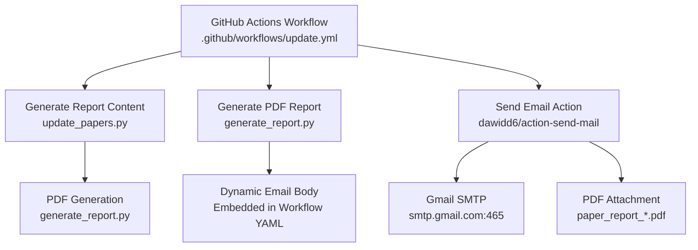
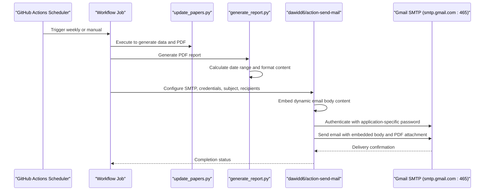
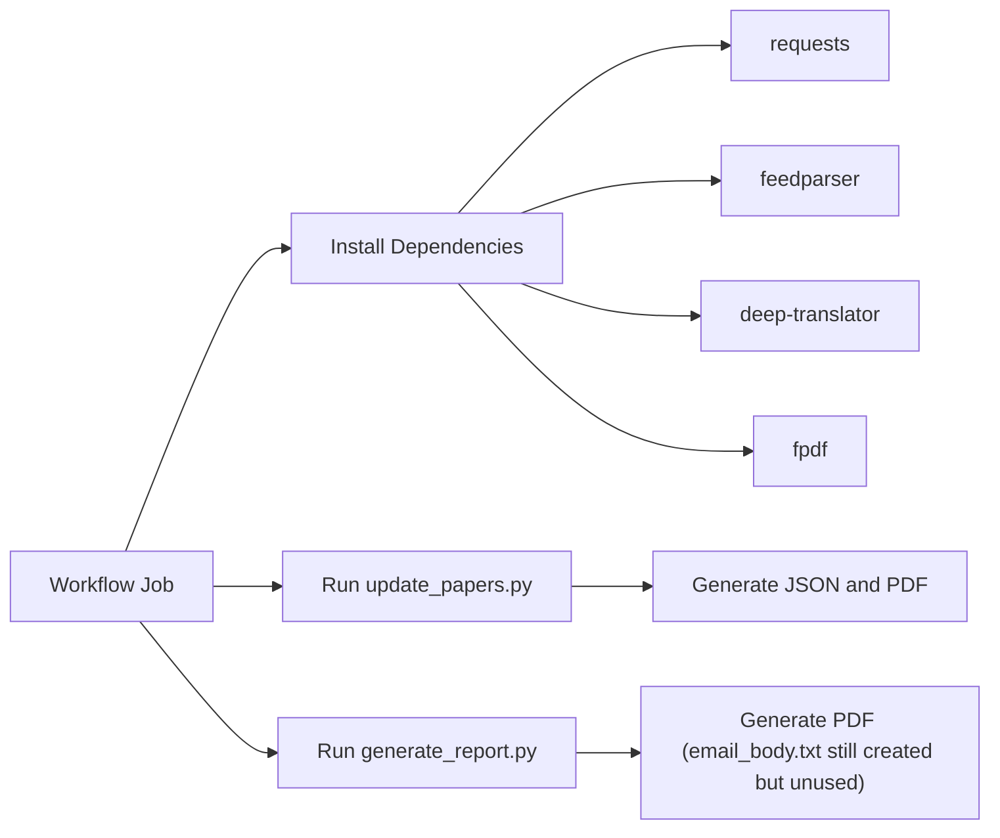

# Email Notification System

<cite>
**Referenced Files in This Document**
- [.github/workflows/update.yml](file://.github/workflows/update.yml)
- [email_body.txt](file://email_body.txt)
- [generate_report.py](file://generate_report.py)
- [test_mail.py](file://test_mail.py)
- [update_papers.py](file://update_papers.py)
- [README.md](file://README.md)
- [requirements.txt](file://requirements.txt)
</cite>

## Update Summary
**Changes Made**
- Updated email body configuration section to reflect the elimination of external email_body.txt dependency
- Modified workflow architecture diagram to show direct email body embedding
- Updated troubleshooting section to address new email body handling approach
- Revised dependency analysis to clarify the role of email_body.txt in the current system

## Table of Contents
1. [Introduction](#introduction)
2. [Project Structure](#project-structure)
3. [Core Components](#core-components)
4. [Architecture Overview](#architecture-overview)
5. [Detailed Component Analysis](#detailed-component-analysis)
6. [Dependency Analysis](#dependency-analysis)
7. [Performance Considerations](#performance-considerations)
8. [Troubleshooting Guide](#troubleshooting-guide)
9. [Conclusion](#conclusion)
10. [Appendices](#appendices)

## Introduction
This document provides comprehensive setup and configuration guidance for the email notification system used by the automated weekly paper report pipeline. It covers Gmail SMTP configuration, authentication with OAuth2 and application-specific passwords, the email body content structure and dynamic generation, attachment of PDF reports, recipient and sender identity configuration, and troubleshooting for common delivery failures, rate limiting, and security policy conflicts. It also outlines alternative SMTP providers and backup notification methods.

## Project Structure
The email notification system integrates with the weekly update workflow and relies on a GitHub Actions job to:
- Generate the weekly report content
- Attach a PDF report
- Send an email via Gmail SMTP with dynamically generated content

Key components involved in email delivery:
- Workflow definition for scheduling and sending emails
- Dynamic email body content generation and embedding
- Test script for validating SMTP credentials
- Dependencies required for PDF generation and translation

**Diagram sources**
- [.github/workflows/update.yml:27-40](file://.github/workflows/update.yml#L27-L40)
- [update_papers.py:194-217](file://update_papers.py#L194-L217)
- [generate_report.py:116-175](file://generate_report.py#L116-L175)

**Section sources**
- [.github/workflows/update.yml:1-61](file://.github/workflows/update.yml#L1-L61)
- [README.md:19-32](file://README.md#L19-L32)

## Core Components
- Gmail SMTP configuration
  - Server address: smtp.gmail.com
  - Port: 465
  - Encryption: SSL/TLS enabled
- Authentication
  - Application-specific password (16-character) stored in GitHub Secrets
  - Sender identity configured as "Seismology Bot"
- Email body content
  - **Updated**: Now generated dynamically and embedded directly in workflow YAML using dynamic content substitution
  - Date range information is automatically calculated and inserted into the email body
- Attachment
  - PDF report named with date range pattern attached to the email
- Recipients
  - Single or multiple recipients configured via GitHub Secrets

**Section sources**
- [.github/workflows/update.yml:39-51](file://.github/workflows/update.yml#L39-L51)
- [README.md:21-24](file://README.md#L21-L24)

## Architecture Overview
The email notification pipeline is orchestrated by GitHub Actions. The workflow:
- Runs on a weekly schedule and on demand
- Installs dependencies including a PDF library
- Executes the update script to generate JSON data and a PDF report
- Generates email body content dynamically and embeds it directly in the workflow
- Sends an email with the dynamically generated body and PDF attachment

**Diagram sources**
- [.github/workflows/update.yml:27-40](file://.github/workflows/update.yml#L27-L40)
- [update_papers.py:194-217](file://update_papers.py#L194-L217)
- [generate_report.py:116-175](file://generate_report.py#L116-L175)

## Detailed Component Analysis

### Gmail SMTP Configuration
- Server address: smtp.gmail.com
- Port: 465
- Encryption: TLS/SSL enabled
- Authentication: Requires application-specific password (16 characters) stored in GitHub Secrets
- Sender identity: "Seismology Bot"
- Recipients: Configured via MAIL_TO secret

These settings are defined in the workflow and enforced by the action.

**Section sources**
- [.github/workflows/update.yml:42-49](file://.github/workflows/update.yml#L42-L49)
- [README.md:21-24](file://README.md#L21-L24)

### Authentication Process and Security
- Two-factor authentication must be enabled on the Gmail account
- Application-specific password must be used (not the regular Gmail password)
- The workflow sets secure: true and uses port 465

Common authentication error and resolution:
- Error: 535 Login fail
  - Cause: Incorrect or missing application-specific password, or incorrect YAML configuration
  - Resolution: Ensure 2FA is enabled, generate a 16-character app password, remove spaces, and confirm server_port is 465 and secure is true

**Section sources**
- [README.md:26-31](file://README.md#L26-L31)
- [.github/workflows/update.yml:42-44](file://.github/workflows/update.yml#L42-L44)

### Dynamic Email Body Content Generation
**Updated**: The email body content is now generated dynamically and embedded directly in the workflow YAML, eliminating the external email_body.txt dependency.

- **Dynamic Content**: Email body is generated using workflow environment variables and date range calculations
- **Content Structure**: Includes formatted date range, topic headers, and article listings with titles, authors, and links
- **Format**: Plain text with topic grouping and article numbering
- **Embedding Method**: Uses `${{ steps.date_range.outputs.display_date }}` syntax for dynamic content insertion
- **File Generation**: The email_body.txt file is still generated by generate_report.py but is not used by the workflow

Customization options:
- Modify the date range calculation in the workflow step
- Adjust the email body format string in the workflow YAML
- Customize topic headers and article presentation format
- Update the dynamic content substitution patterns as needed

**Section sources**
- [.github/workflows/update.yml:30-37](file://.github/workflows/update.yml#L30-L37)
- [.github/workflows/update.yml:47-50](file://.github/workflows/update.yml#L47-L50)
- [generate_report.py:116-175](file://generate_report.py#L116-L175)

### Attachment Process for PDF Reports
- The workflow attaches a PDF file with a date-range pattern in the filename
- The update script generates the PDF during the workflow run
- Ensure the PDF is generated and present under the expected path before sending

**Section sources**
- [.github/workflows/update.yml:51](file://.github/workflows/update.yml#L51)
- [generate_report.py:163-175](file://generate_report.py#L163-L175)

### Recipient Configuration and Sender Identity Setup
- Recipients: MAIL_TO secret
- Sender identity: "Seismology Bot"
- Username: MAIL_USERNAME secret

Ensure secrets are set in GitHub repository settings under Actions.

**Section sources**
- [.github/workflows/update.yml:45-49](file://.github/workflows/update.yml#L45-L49)
- [README.md:21-24](file://README.md#L21-L24)

### Testing SMTP Credentials Locally
- A local test script demonstrates connecting to Gmail SMTP over SSL, authenticating, and sending a verification email
- Use this script to validate credentials before relying on the GitHub Actions workflow

Key elements validated by the script:
- SMTP server and port
- SSL connection
- Login with username and application-specific password
- Sending a test message to a receiver

**Section sources**
- [test_mail.py:12-36](file://test_mail.py#L12-L36)

## Dependency Analysis
External dependencies required for the workflow:
- requests, feedparser, deep-translator for data fetching and translation
- fpdf for PDF generation

These are installed in the workflow job prior to running the update script.

**Diagram sources**
- [.github/workflows/update.yml:20-25](file://.github/workflows/update.yml#L20-L25)
- [requirements.txt:1-7](file://requirements.txt#L1-L7)

**Section sources**
- [.github/workflows/update.yml:20-25](file://.github/workflows/update.yml#L20-L25)
- [requirements.txt:1-7](file://requirements.txt#L1-L7)

## Performance Considerations
- Network latency and timeouts: The update script includes timeouts for external APIs; ensure robust retry logic if needed
- Translation costs: Using a translation service may incur usage limits; monitor quotas
- PDF generation: Large reports may increase processing time; optimize content length and formatting
- Rate limiting: External APIs (Crossref, arXiv) may throttle requests; consider staggering or caching
- **Updated**: Dynamic content generation reduces file I/O overhead by eliminating external file reads

## Troubleshooting Guide

### Common Authentication Errors
- Symptom: 535 Login fail
  - Verify two-factor authentication is enabled on the Gmail account
  - Confirm the application-specific password is 16 characters and has no spaces
  - Ensure the workflow YAML specifies server_port: 465 and secure: true

**Section sources**
- [README.md:26-31](file://README.md#L26-L31)
- [.github/workflows/update.yml:42-44](file://.github/workflows/update.yml#L42-L44)

### Email Delivery Failures
- Validate recipient address in MAIL_TO
- **Updated**: Confirm that the email body content is properly generated and embedded in the workflow
- Ensure the PDF file with date-range pattern is generated and attached before sending

**Section sources**
- [.github/workflows/update.yml:47-51](file://.github/workflows/update.yml#L47-L51)

### Rate Limiting Issues
- External APIs may limit requests per second or minute
- Add delays between API calls if necessary
- Consider caching recent results to reduce repeated calls

**Section sources**
- [update_papers.py:104-124](file://update_papers.py#L104-L124)

### Security Policy Conflicts
- Some organizations restrict SMTP relay or require specific authentication mechanisms
- Use application-specific passwords for Gmail
- For enterprise environments, configure an internal SMTP relay or use a compliant email service

**Section sources**
- [README.md:26-31](file://README.md#L26-L31)

### Dynamic Content Issues
**New**: Troubleshooting for the new dynamic email body system:
- **Symptom**: Email body appears empty or malformed
- **Cause**: Missing or incorrectly formatted date range outputs
- **Resolution**: Verify the date_range step is executing successfully and outputs are properly formatted
- **Symptom**: Date range not displaying correctly
- **Cause**: Environment variable substitution issues in the workflow
- **Resolution**: Check the date_range step configuration and ensure proper output formatting

**Section sources**
- [.github/workflows/update.yml:30-37](file://.github/workflows/update.yml#L30-L37)
- [.github/workflows/update.yml:47-50](file://.github/workflows/update.yml#L47-L50)

## Conclusion
The email notification system is designed to reliably deliver a weekly paper report via Gmail SMTP. The recent simplification eliminates the external email_body.txt dependency by generating and embedding email content directly in the workflow YAML. This reduces complexity and external file dependencies while maintaining the ability to customize email content through dynamic content substitution. By following the configuration steps, using application-specific passwords, and validating credentials locally, you can minimize authentication and delivery issues.

## Appendices

### Alternative SMTP Providers
- Outlook/Office 365
  - Server: smtp-mail.outlook.com
  - Port: 587
  - Encryption: TLS
  - Authentication: Standard username/password or OAuth2 depending on provider settings
- Yahoo Mail
  - Server: smtp.mail.yahoo.com
  - Port: 587
  - Encryption: TLS
  - Authentication: Standard username/password or OAuth2
- Generic SMTP
  - Use your provider's SMTP host, port, and TLS settings
  - Authentication: Username/password or OAuth2 as supported

### Backup Notification Methods
- Slack or Teams webhooks for channel notifications
- Email to multiple recipients or distribution lists
- RSS feeds or Atom feeds for subscribers
- GitHub Discussions or Issues for announcements