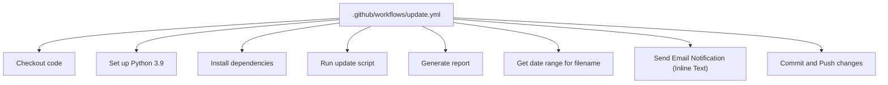
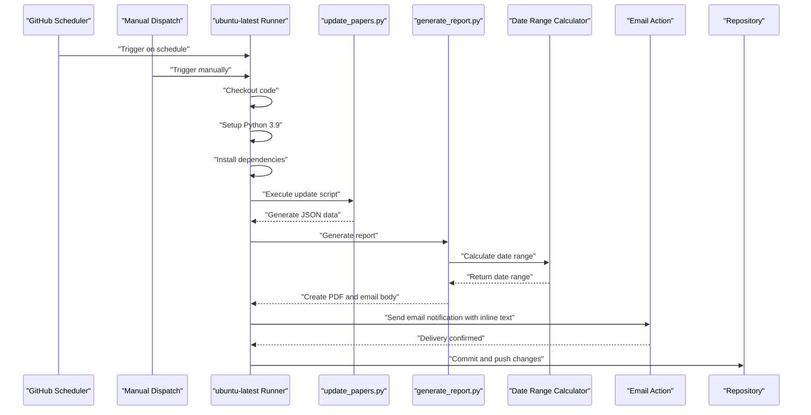
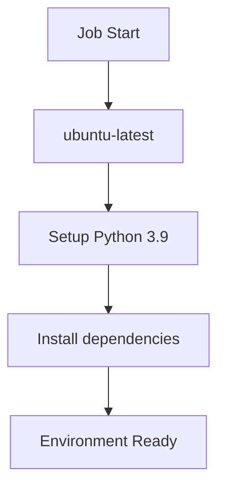
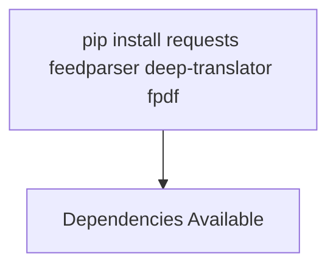
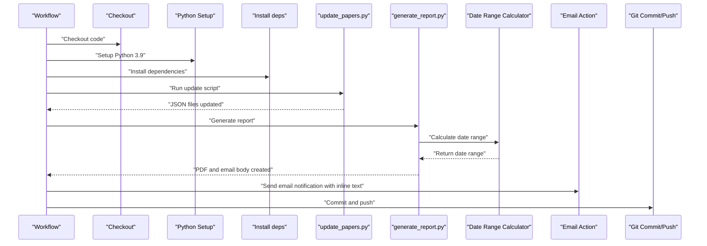
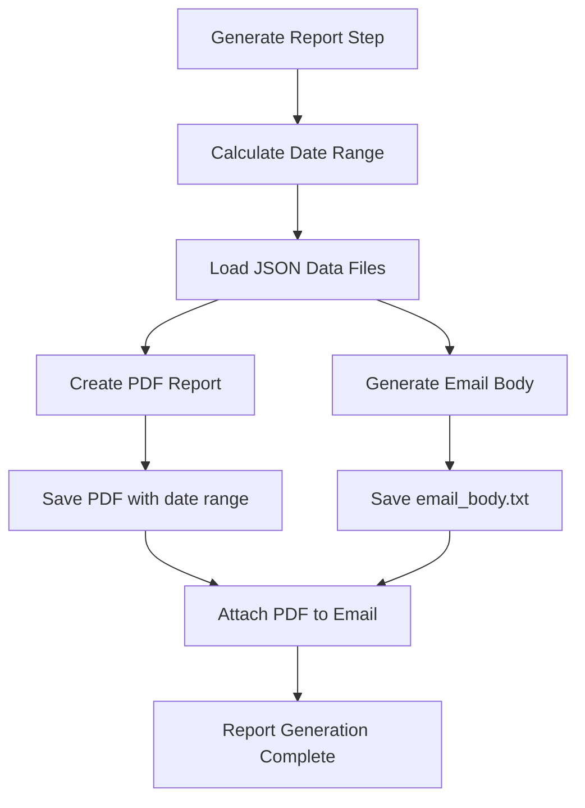
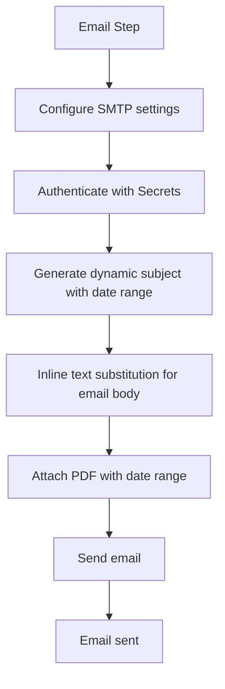
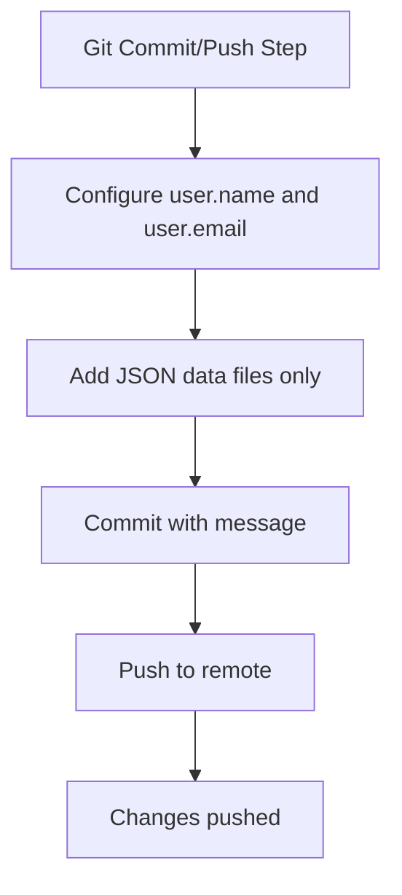
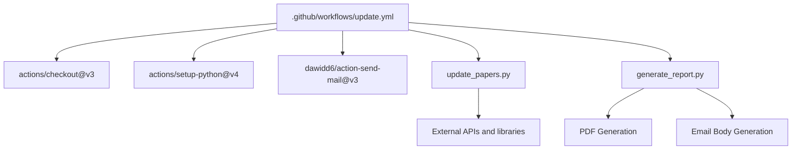

# GitHub Actions Workflow

<cite>
**Referenced Files in This Document**
- [update.yml](file://.github/workflows/update.yml)
- [update_papers.py](file://update_papers.py)
- [generate_report.py](file://generate_report.py)
- [requirements.txt](file://requirements.txt)
- [email_body.txt](file://email_body.txt)
- [README.md](file://README.md)
- [deploy.sh](file://deploy.sh)
- [test_mail.py](file://test_mail.py)
- [data_cryo.json](file://data_cryo.json)
- [data_ai.json](file://data_ai.json)
- [data_imaging.json](file://data_imaging.json)
- [data_das.json](file://data_das.json)
- [data_surface.json](file://data_surface.json)
- [data_earthquake.json](file://data_earthquake.json)
</cite>

## Update Summary
**Changes Made**
- Updated email notification system to use inline text substitution instead of external file references
- Simplified workflow by removing email_body.txt from git staging operations
- Enhanced email configuration to use dynamic inline content generation
- Streamlined report generation process with improved email body handling

## Table of Contents
1. [Introduction](#introduction)
2. [Project Structure](#project-structure)
3. [Core Components](#core-components)
4. [Architecture Overview](#architecture-overview)
5. [Detailed Component Analysis](#detailed-component-analysis)
6. [Dependency Analysis](#dependency-analysis)
7. [Performance Considerations](#performance-considerations)
8. [Troubleshooting Guide](#troubleshooting-guide)
9. [Conclusion](#conclusion)
10. [Appendices](#appendices)

## Introduction
This document explains how to configure and operate the GitHub Actions workflow for the paper_weekly project. It covers the weekly cron schedule, job environment setup, dependency installation, triggers (scheduled and manual), step-by-step execution flow, environment variable usage with GitHub Secrets, security considerations, troubleshooting, and guidance for customization and monitoring.

## Project Structure
The workflow is defined in a YAML file under the GitHub Actions workflows directory. The workflow orchestrates:
- Code checkout
- Python environment setup
- Dependency installation
- Execution of the update script
- Report generation with dynamic date range calculations
- Email notification sending with enhanced inline text substitution
- Automatic Git commit and push

**Diagram sources**
- [update.yml:12-61](file://.github/workflows/update.yml#L12-L61)

**Section sources**
- [.github/workflows/update.yml:1-61](file://.github/workflows/update.yml#L1-L61)

## Core Components
- Workflow definition: Declares schedule and manual dispatch triggers, and the job steps.
- Update script: Performs paper fetching, translation, and JSON data generation.
- Report generation script: Creates PDF reports and email bodies with dynamic date ranges.
- **Enhanced**: Inline email text substitution system: Eliminates external file dependencies for email content.
- Secrets: Credentials and recipient configured via GitHub Actions Secrets.
- Deployment helper: Local deployment script for manual updates.

**Section sources**
- [update.yml:1-61](file://.github/workflows/update.yml#L1-L61)
- [update_papers.py:1-217](file://update_papers.py#L1-L217)
- [generate_report.py:1-175](file://generate_report.py#L1-L175)
- [email_body.txt:1-74](file://email_body.txt#L1-L74)
- [README.md:19-32](file://README.md#L19-L32)
- [deploy.sh:1-34](file://deploy.sh#L1-L34)

## Architecture Overview
The workflow executes on a Linux runner, installs Python 3.9, runs the update script, generates reports with dynamic date ranges, sends an email notification with inline text substitution, and pushes changes to the repository.

**Diagram sources**
- [update.yml:3-61](file://.github/workflows/update.yml#L3-L61)
- [update_papers.py:194-217](file://update_papers.py#L194-L217)
- [generate_report.py:163-175](file://generate_report.py#L163-L175)

## Detailed Component Analysis

### Cron Schedule and Triggers
- Schedule: Weekly at midnight on Sundays in UTC.
- Manual dispatch: Allows triggering the workflow from the GitHub UI.

**Diagram sources**
- [update.yml:4-6](file://.github/workflows/update.yml#L4-L6)

**Section sources**
- [update.yml:4-6](file://.github/workflows/update.yml#L4-L6)

### Job Environment Setup
- Runner: ubuntu-latest
- Python: 3.9 via actions/setup-python
- Dependencies: Installed via pip in the workflow

**Diagram sources**
- [update.yml:10-22](file://.github/workflows/update.yml#L10-L22)

**Section sources**
- [update.yml:10-22](file://.github/workflows/update.yml#L10-L22)

### Dependency Installation
- The workflow installs packages required by the update script and report generator.
- The repository also includes a requirements.txt file for local development.

**Diagram sources**
- [update.yml:20-22](file://.github/workflows/update.yml#L20-L22)
- [requirements.txt:1-7](file://requirements.txt#L1-L7)

**Section sources**
- [update.yml:20-22](file://.github/workflows/update.yml#L20-L22)
- [requirements.txt:1-7](file://requirements.txt#L1-L7)

### Step-by-Step Execution Flow
1. Checkout code
2. Set up Python 3.9
3. Install dependencies
4. Run update script
5. Generate report
6. Get date range for filename
7. **Enhanced**: Send email notification with inline text substitution
8. Commit and push changes

**Diagram sources**
- [update.yml:12-61](file://.github/workflows/update.yml#L12-L61)
- [update_papers.py:194-217](file://update_papers.py#L194-L217)
- [generate_report.py:163-175](file://generate_report.py#L163-L175)

**Section sources**
- [update.yml:12-61](file://.github/workflows/update.yml#L12-L61)
- [update_papers.py:194-217](file://update_papers.py#L194-L217)
- [generate_report.py:163-175](file://generate_report.py#L163-L175)

### Report Generation System
- **Dedicated Generate report step**: Separates data generation from report creation for better modularity.
- **Dynamic date range calculations**: Both in workflow (shell commands) and report generator (Python datetime).
- **Enhanced email configuration**: Uses inline text substitution instead of external file references.
- **Dual output generation**: Creates both PDF reports and email body templates.

**Diagram sources**
- [update.yml:27-38](file://.github/workflows/update.yml#L27-L38)
- [generate_report.py:163-175](file://generate_report.py#L163-L175)

**Section sources**
- [update.yml:27-38](file://.github/workflows/update.yml#L27-L38)
- [generate_report.py:163-175](file://generate_report.py#L163-L175)

### **Enhanced** Email Notification Sending
- Uses a community action to send SMTP emails.
- **New**: Inline text substitution eliminates external file dependencies.
- **New**: Dynamic subject line with calculated date range display.
- **New**: Dynamic attachment naming with date range parameters.
- Reads credentials and recipients from GitHub Secrets.
- Sends the generated email body inline without file dependencies.

**Updated** The email notification system now uses inline text substitution instead of external file references, simplifying the workflow and eliminating the need for email_body.txt in git staging operations.

**Diagram sources**
- [update.yml:39-51](file://.github/workflows/update.yml#L39-L51)
- [email_body.txt:1-74](file://email_body.txt#L1-L74)

**Section sources**
- [update.yml:39-51](file://.github/workflows/update.yml#L39-L51)
- [email_body.txt:1-74](file://email_body.txt#L1-L74)

### Automatic Git Commits and Push
- Configures a bot user for commits.
- **Enhanced**: Simplified staging by focusing on JSON data files only.
- Handles "no changes to commit" gracefully.

**Updated** The workflow now simplifies git staging operations by focusing on JSON data files and eliminating email_body.txt from the staging process.

**Diagram sources**
- [update.yml:53-61](file://.github/workflows/update.yml#L53-L61)

**Section sources**
- [update.yml:53-61](file://.github/workflows/update.yml#L53-L61)

### Environment Variables and GitHub Secrets
- Secrets used:
  - MAIL_USERNAME: Sender address
  - MAIL_PASSWORD: Application-specific password
  - MAIL_TO: Recipient address
- These are referenced in the workflow to configure the email action.

Security considerations:
- Use application-specific passwords for Gmail.
- Store sensitive values only in GitHub Secrets.
- Keep the workflow minimal and scoped to necessary permissions.

**Section sources**
- [update.yml:45-48](file://.github/workflows/update.yml#L45-L48)
- [README.md:19-32](file://README.md#L19-L32)

### Data Generation and Output
- The update script generates topic-specific JSON files.
- Report generator processes these files to create PDF reports and email bodies.
- Example outputs include:
  - data_cryo.json
  - data_ai.json
  - data_imaging.json
  - data_das.json
  - data_surface.json
  - data_earthquake.json
  - paper_report_YYYYMMDD_YYYYMMDD.pdf (generated dynamically)
  - email_body.txt (generated dynamically)

**Updated** The workflow now focuses on JSON data files for staging, while email_body.txt continues to be generated but is not included in git operations.

These files are committed and pushed by the workflow.

**Section sources**
- [update_papers.py:42-84](file://update_papers.py#L42-L84)
- [generate_report.py:19-27](file://generate_report.py#L19-L27)
- [data_cryo.json:1-5](file://data_cryo.json#L1-L5)
- [data_ai.json:1-5](file://data_ai.json#L1-L5)
- [data_imaging.json:1-5](file://data_imaging.json#L1-L5)
- [data_das.json:1-5](file://data_das.json#L1-L5)
- [data_surface.json:1-5](file://data_surface.json#L1-L5)
- [data_earthquake.json:1-5](file://data_earthquake.json#L1-L5)

## Dependency Analysis
The workflow depends on:
- actions/checkout for code retrieval
- actions/setup-python for Python runtime
- A community email action for notifications
- The update script for data generation
- The report generation script for PDF and email creation

**Updated** The workflow now has simplified dependencies with inline text substitution reducing external file dependencies.

**Diagram sources**
- [update.yml:12-22](file://.github/workflows/update.yml#L12-L22)
- [update.yml:27-39](file://.github/workflows/update.yml#L27-L39)
- [update_papers.py:1-10](file://update_papers.py#L1-10)
- [generate_report.py:1-10](file://generate_report.py#L1-10)

**Section sources**
- [update.yml:12-51](file://.github/workflows/update.yml#L12-L51)
- [update_papers.py:1-10](file://update_papers.py#L1-10)
- [generate_report.py:1-10](file://generate_report.py#L1-10)

## Performance Considerations
- Network timeouts: The update script sets timeouts for external API calls.
- Translation limits: The translator is constrained by length and rate limits.
- Dependency installation: Installing lightweight packages reduces runtime overhead.
- Email delivery: Using SSL/TLS with correct ports improves reliability.
- **Enhanced**: Inline text substitution reduces file I/O operations and eliminates external file dependencies.
- **Improved**: Report generation optimization with streamlined email content processing.

## Troubleshooting Guide
Common issues and resolutions:
- Email authentication failure:
  - Ensure two-factor authentication is enabled.
  - Use a 16-character application-specific password.
  - Verify SMTP settings in the workflow match the provider's requirements.
- **Enhanced**: Inline text substitution issues:
  - Verify that the date range calculation commands execute successfully.
  - Check that the email action supports inline text substitution.
  - Ensure proper escaping of special characters in inline content.
- No changes to commit:
  - The workflow handles this case gracefully; ensure the update script produces data.
- Manual testing:
  - Use the provided script to test SMTP connectivity locally.

**Section sources**
- [README.md:26-32](file://README.md#L26-L32)
- [test_mail.py:12-36](file://test_mail.py#L12-L36)

## Conclusion
The GitHub Actions workflow automates weekly paper updates, report generation, email notifications, and repository synchronization. By leveraging scheduled and manual triggers, a controlled Python environment, dedicated report generation system with dynamic date ranges, inline text substitution for email content, and secure secret management, the system reliably maintains updated research data and notifies stakeholders with enhanced reporting capabilities.

## Appendices

### Modifying Execution Schedules
- Adjust the cron expression in the schedule section to change the weekly cadence.
- Consider timezone implications; the schedule runs in UTC.

**Section sources**
- [update.yml:5](file://.github/workflows/update.yml#L5)

### Adding Custom Steps
- Extend the workflow by adding new steps after dependency installation.
- Ensure any new dependencies are installed in the workflow.
- Consider adding steps for report validation or additional processing.

**Section sources**
- [update.yml:20-22](file://.github/workflows/update.yml#L20-L22)

### Monitoring Workflow Performance
- Review workflow logs for errors during dependency installation, script execution, report generation, email sending, and Git operations.
- Use the manual dispatch option to quickly validate changes.
- Monitor report generation step separately for debugging PDF creation issues.

**Section sources**
- [update.yml:6](file://.github/workflows/update.yml#L6)

### Customizing Report Generation
- Modify the generate_report.py script to change report format or content.
- Adjust date range calculations for different reporting periods.
- Customize PDF styling and email templates as needed.

**Section sources**
- [generate_report.py:12-17](file://generate_report.py#L12-L17)
- [generate_report.py:55-114](file://generate_report.py#L55-L114)
- [generate_report.py:116-161](file://generate_report.py#L116-L161)

### **Enhanced**: Email Configuration Best Practices
- Use inline text substitution for dynamic content generation.
- Leverage GitHub Actions outputs for date range calculations.
- Ensure proper email content formatting for different client compatibility.
- Test email delivery with the provided test script before production use.

**Section sources**
- [update.yml:39-51](file://.github/workflows/update.yml#L39-L51)
- [test_mail.py:12-36](file://test_mail.py#L12-L36)