# GitHub Actions Workflow

<cite>
**Referenced Files in This Document**
- [update.yml](file://.github/workflows/update.yml)
- [update_papers.py](file://update_papers.py)
- [update_citations.py](file://update_citations.py)
- [generate_report.py](file://generate_report.py)
- [requirements.txt](file://requirements.txt)
- [data_citations.json](file://data_citations.json)
- [README.md](file://README.md)
- [deploy.sh](file://deploy.sh)
- [test_mail.py](file://test_mail.py)
- [data_cryo.json](file://data_cryo.json)
- [data_ai.json](file://data_ai.json)
- [data_imaging.json](file://data_imaging.json)
- [data_das.json](file://data_das.json)
- [data_surface.json](file://data_surface.json)
- [data_earthquake.json](file://data_earthquake.json)
</cite>

## Update Summary
**Changes Made**
- Enhanced workflow with new scholarly library dependency for citation fetching
- Added automated citation data updates using Google Scholar scraping
- Expanded workflow capabilities to support citations tracking system
- Updated dependency installation to include scholarly package
- Integrated citation data generation into the weekly update process
- Modified data staging to include citation JSON files

## Table of Contents
1. [Introduction](#introduction)
2. [Project Structure](#project-structure)
3. [Core Components](#core-components)
4. [Architecture Overview](#architecture-overview)
5. [Detailed Component Analysis](#detailed-component-analysis)
6. [Dependency Analysis](#dependency-analysis)
7. [Performance Considerations](#performance-considerations)
8. [Troubleshooting Guide](#troubleshooting-guide)
9. [Conclusion](#conclusion)
10. [Appendices](#appendices)

## Introduction
This document explains how to configure and operate the GitHub Actions workflow for the paper_weekly project. It covers the weekly cron schedule, job environment setup, dependency installation, triggers (scheduled and manual), step-by-step execution flow, environment variable usage with GitHub Secrets, security considerations, troubleshooting, and guidance for customization and monitoring.

## Project Structure
The workflow is defined in a YAML file under the GitHub Actions workflows directory. The workflow orchestrates:
- Code checkout
- Python environment setup
- Dependency installation (including scholarly library)
- Execution of the main update script
- Automated citation data fetching from Google Scholar
- Report generation with dynamic date range calculations
- Email notification sending with enhanced inline text substitution
- Automatic Git commit and push with citation data inclusion

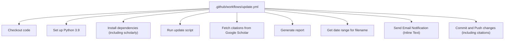

**Diagram sources**
- [update.yml:12-64](file://.github/workflows/update.yml#L12-L64)

**Section sources**
- [.github/workflows/update.yml:1-64](file://.github/workflows/update.yml#L1-L64)

## Core Components
- Workflow definition: Declares schedule and manual dispatch triggers, and the job steps.
- Update script: Performs paper fetching, translation, and JSON data generation.
- Citation fetching script: Automatically retrieves papers that cited the user's publications using the scholarly library.
- Report generation script: Creates PDF reports and email bodies with dynamic date ranges.
- Enhanced inline email text substitution system: Eliminates external file dependencies for email content.
- Secrets: Credentials and recipient configured via GitHub Actions Secrets.
- Deployment helper: Local deployment script for manual updates.

**Section sources**
- [update.yml:1-64](file://.github/workflows/update.yml#L1-L64)
- [update_papers.py:1-217](file://update_papers.py#L1-L217)
- [update_citations.py:1-110](file://update_citations.py#L1-L110)
- [generate_report.py:1-129](file://generate_report.py#L1-L129)
- [README.md:19-32](file://README.md#L19-L32)
- [deploy.sh:1-34](file://deploy.sh#L1-L34)

## Architecture Overview
The workflow executes on a Linux runner, installs Python 3.9 with the scholarly library, runs the update script to fetch papers from Crossref and arXiv, automatically fetches citation data from Google Scholar, generates reports with dynamic date ranges, sends an email notification with inline text substitution, and pushes changes to the repository including citation data.

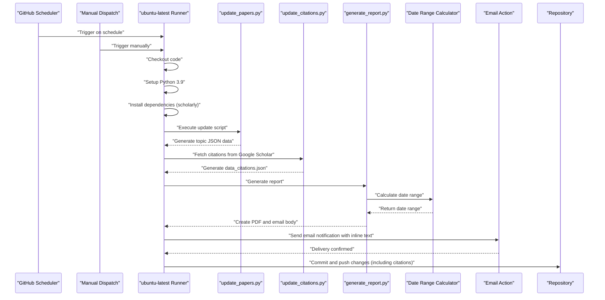

**Diagram sources**
- [update.yml:3-64](file://.github/workflows/update.yml#L3-L64)
- [update_papers.py:194-217](file://update_papers.py#L194-L217)
- [update_citations.py:22-92](file://update_citations.py#L22-L92)
- [generate_report.py:118-129](file://generate_report.py#L118-L129)

## Detailed Component Analysis

### Cron Schedule and Triggers
- Schedule: Weekly at midnight on Sundays in UTC.
- Manual dispatch: Allows triggering the workflow from the GitHub UI.

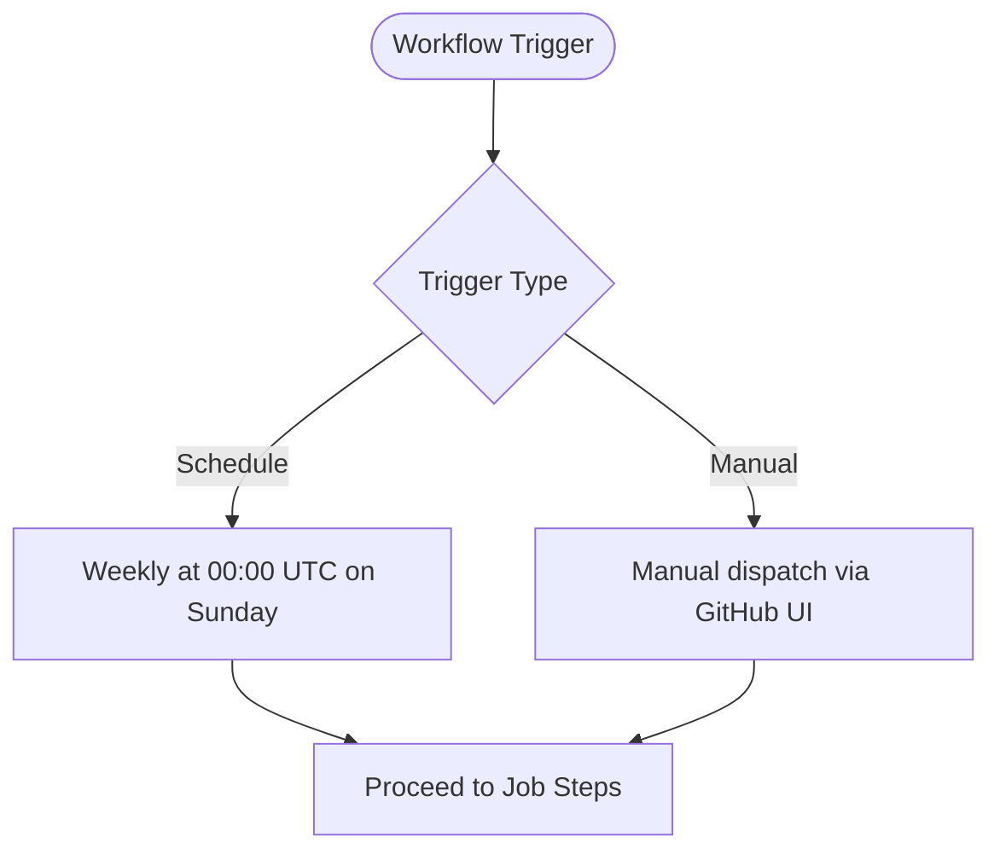

**Diagram sources**
- [update.yml:4-6](file://.github/workflows/update.yml#L4-L6)

**Section sources**
- [update.yml:4-6](file://.github/workflows/update.yml#L4-L6)

### Job Environment Setup
- Runner: ubuntu-latest
- Python: 3.9 via actions/setup-python
- Dependencies: Installed via pip in the workflow, including the new scholarly library

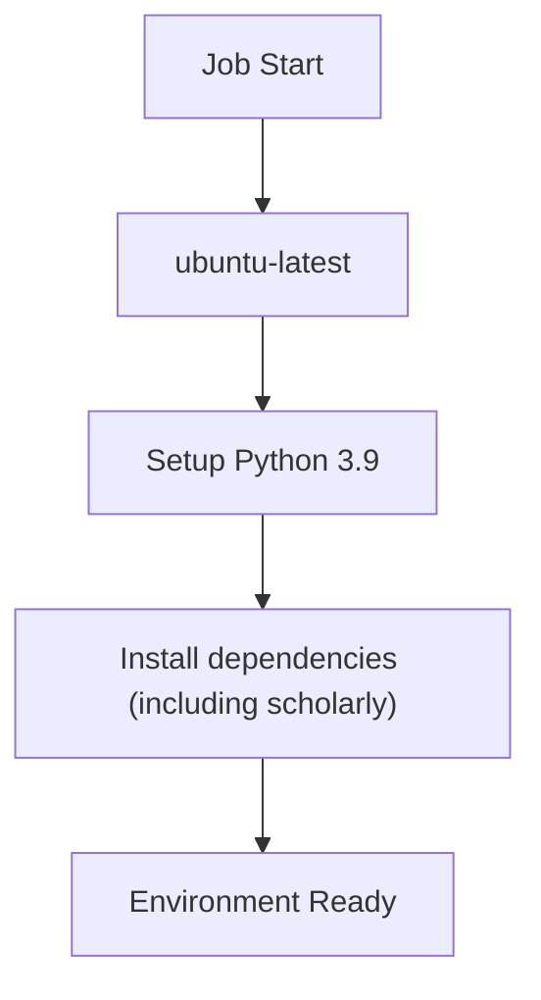

**Diagram sources**
- [update.yml:10-22](file://.github/workflows/update.yml#L10-L22)

**Section sources**
- [update.yml:10-22](file://.github/workflows/update.yml#L10-L22)

### Enhanced Dependency Installation
- The workflow installs packages required by the update script, report generator, and the new scholarly library for citation fetching.
- The repository also includes a requirements.txt file for local development.
- **New**: Added scholarly library dependency for Google Scholar scraping functionality.

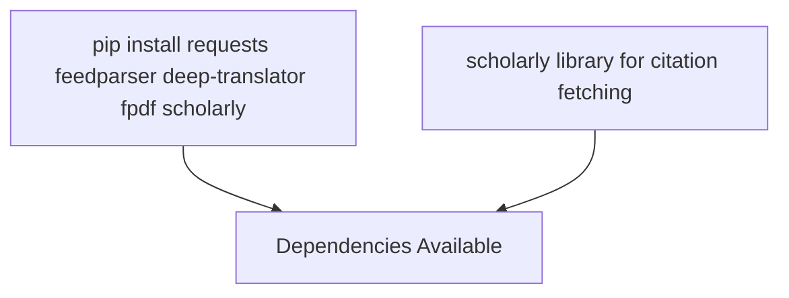

**Diagram sources**
- [update.yml:20-22](file://.github/workflows/update.yml#L20-L22)
- [requirements.txt:1-7](file://requirements.txt#L1-L7)

**Section sources**
- [update.yml:20-22](file://.github/workflows/update.yml#L20-L22)
- [requirements.txt:1-7](file://requirements.txt#L1-L7)

### Step-by-Step Execution Flow
1. Checkout code
2. Set up Python 3.9
3. Install dependencies (including scholarly)
4. Run update script
5. **New**: Fetch citations from Google Scholar
6. Generate report
7. Get date range for filename
8. **Enhanced**: Send email notification with inline text substitution
9. Commit and push changes (including citation data)

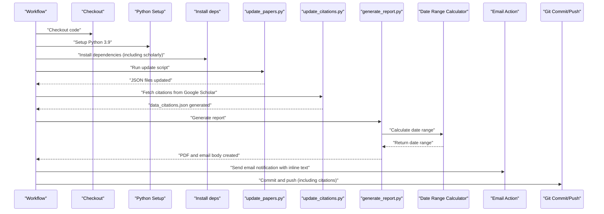

**Diagram sources**
- [update.yml:12-64](file://.github/workflows/update.yml#L12-L64)
- [update_papers.py:194-217](file://update_papers.py#L194-L217)
- [update_citations.py:22-92](file://update_citations.py#L22-L92)
- [generate_report.py:118-129](file://generate_report.py#L118-L129)

**Section sources**
- [update.yml:12-64](file://.github/workflows/update.yml#L12-L64)
- [update_papers.py:194-217](file://update_papers.py#L194-L217)
- [update_citations.py:22-92](file://update_citations.py#L22-L92)
- [generate_report.py:118-129](file://generate_report.py#L118-L129)

### Enhanced Citation Data System
- **New**: Automated citation fetching using the scholarly library (Google Scholar scraper)
- **New**: Fetches papers that cited the user's publications in the past week
- **New**: Integrates with the existing paper update system
- **New**: Generates structured citation data in data_citations.json format
- **New**: Handles scholarly library installation failures gracefully
- **New**: Implements deduplication and sorting of citation results

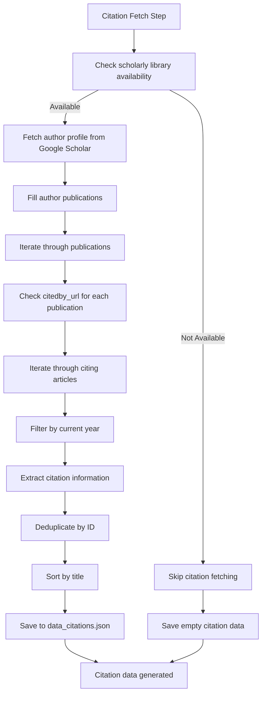

**Diagram sources**
- [update.yml:27-28](file://.github/workflows/update.yml#L27-L28)
- [update_citations.py:22-92](file://update_citations.py#L22-L92)

**Section sources**
- [update.yml:27-28](file://.github/workflows/update.yml#L27-L28)
- [update_citations.py:1-110](file://update_citations.py#L1-L110)

### Report Generation System
- **Dedicated Generate report step**: Separates data generation from report creation for better modularity.
- **Dynamic date range calculations**: Both in workflow (shell commands) and report generator (Python datetime).
- **Enhanced email configuration**: Uses inline text substitution instead of external file references.
- **Dual output generation**: Creates both PDF reports and email body templates.
- **New**: Citation data integration into report generation process.

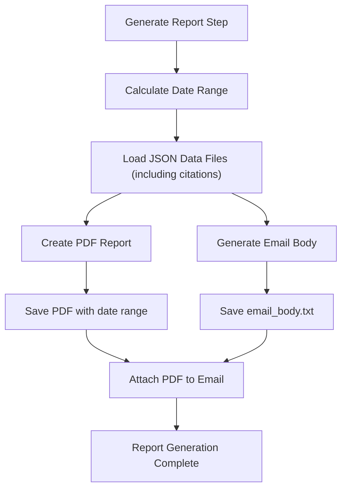

**Diagram sources**
- [update.yml:30-31](file://.github/workflows/update.yml#L30-L31)
- [generate_report.py:118-129](file://generate_report.py#L118-L129)

**Section sources**
- [update.yml:30-31](file://.github/workflows/update.yml#L30-L31)
- [generate_report.py:118-129](file://generate_report.py#L118-L129)

### Enhanced Email Notification Sending
- Uses a community action to send SMTP emails.
- **New**: Inline text substitution eliminates external file dependencies.
- **New**: Dynamic subject line with calculated date range display.
- **New**: Dynamic attachment naming with date range parameters.
- Reads credentials and recipients from GitHub Secrets.
- Sends the generated email body inline without file dependencies.

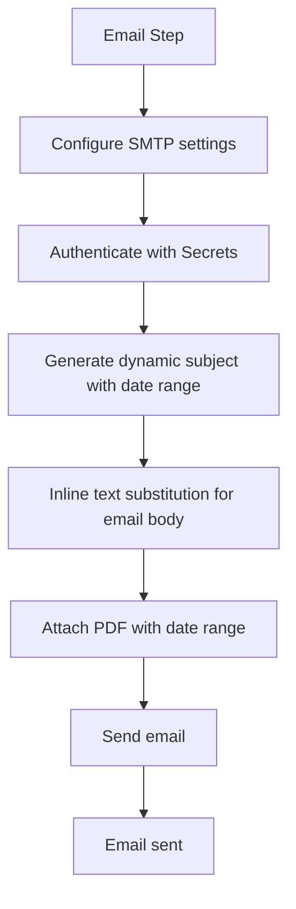

**Diagram sources**
- [update.yml:42-54](file://.github/workflows/update.yml#L42-L54)

**Section sources**
- [update.yml:42-54](file://.github/workflows/update.yml#L42-L54)

### Automatic Git Commits and Push
- Configures a bot user for commits.
- **Enhanced**: Updated staging to include citation JSON files along with topic data files.
- Handles "no changes to commit" gracefully.

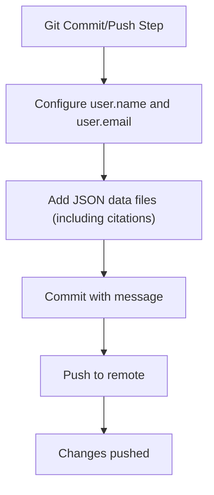

**Diagram sources**
- [update.yml:56-64](file://.github/workflows/update.yml#L56-L64)

**Section sources**
- [update.yml:56-64](file://.github/workflows/update.yml#L56-L64)

### Environment Variables and GitHub Secrets
- Secrets used:
  - MAIL_USERNAME: Sender address
  - MAIL_PASSWORD: Application-specific password
  - MAIL_TO: Recipient address
- These are referenced in the workflow to configure the email action.

Security considerations:
- Use application-specific passwords for Gmail.
- Store sensitive values only in GitHub Secrets.
- Keep the workflow minimal and scoped to necessary permissions.

**Section sources**
- [update.yml:48-50](file://.github/workflows/update.yml#L48-L50)
- [README.md:19-32](file://README.md#L19-L32)

### Data Generation and Output
- The update script generates topic-specific JSON files.
- **New**: Citation fetching script generates data_citations.json with citation information.
- Report generator processes these files to create PDF reports and email bodies.
- Example outputs include:
  - data_cryo.json
  - data_ai.json
  - data_imaging.json
  - data_das.json
  - data_surface.json
  - data_earthquake.json
  - **New**: data_citations.json (automatically generated)
  - paper_report_YYYYMMDD_YYYYMMDD.pdf (generated dynamically)
  - email_body.txt (generated dynamically)

**Updated** The workflow now includes citation data files in git staging operations, providing comprehensive coverage of all generated data.

These files are committed and pushed by the workflow.

**Section sources**
- [update_papers.py:42-84](file://update_papers.py#L42-L84)
- [update_citations.py:18-19](file://update_citations.py#L18-L19)
- [generate_report.py:19-27](file://generate_report.py#L19-L27)
- [data_citations.json:1-6](file://data_citations.json#L1-L6)

## Dependency Analysis
The workflow depends on:
- actions/checkout for code retrieval
- actions/setup-python for Python runtime
- A community email action for notifications
- The update script for data generation
- **New**: The citation fetching script for automated citation data updates
- The report generation script for PDF and email creation
- **New**: The scholarly library for Google Scholar scraping functionality

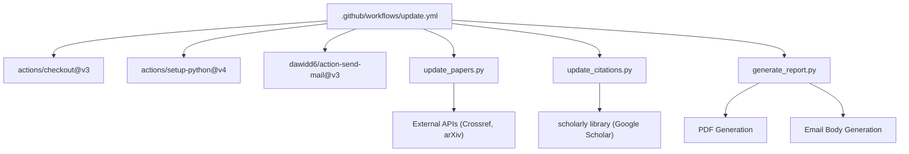

**Diagram sources**
- [update.yml:12-22](file://.github/workflows/update.yml#L12-L22)
- [update.yml:27-31](file://.github/workflows/update.yml#L27-L31)
- [update.yml:42-54](file://.github/workflows/update.yml#L42-L54)
- [update_papers.py:1-10](file://update_papers.py#L1-10)
- [update_citations.py:11-15](file://update_citations.py#L11-L15)
- [generate_report.py:1-10](file://generate_report.py#L1-10)

**Section sources**
- [update.yml:12-64](file://.github/workflows/update.yml#L12-L64)
- [update_papers.py:1-10](file://update_papers.py#L1-10)
- [update_citations.py:11-15](file://update_citations.py#L11-L15)
- [generate_report.py:1-10](file://generate_report.py#L1-10)

## Performance Considerations
- Network timeouts: The update script sets timeouts for external API calls.
- Translation limits: The translator is constrained by length and rate limits.
- Dependency installation: Installing lightweight packages reduces runtime overhead.
- Email delivery: Using SSL/TLS with correct ports improves reliability.
- **Enhanced**: Inline text substitution reduces file I/O operations and eliminates external file dependencies.
- **Improved**: Report generation optimization with streamlined email content processing.
- **New**: Citation fetching performance considerations: Google Scholar scraping may be rate-limited and requires proper handling of network timeouts.
- **New**: Scholarly library installation and fallback mechanisms for graceful degradation.

## Troubleshooting Guide
Common issues and resolutions:
- Email authentication failure:
  - Ensure two-factor authentication is enabled.
  - Use a 16-character application-specific password.
  - Verify SMTP settings in the workflow match the provider's requirements.
- **Enhanced**: Inline text substitution issues:
  - Verify that the date range calculation commands execute successfully.
  - Check that the email action supports inline text substitution.
  - Ensure proper escaping of special characters in inline content.
- **New**: Citation fetching failures:
  - Google Scholar may temporarily block requests; implement retry logic.
  - Ensure the scholarly library is properly installed in the workflow.
  - Check that the Google Scholar author ID is valid and accessible.
  - Verify network connectivity to Google Scholar endpoints.
- No changes to commit:
  - The workflow handles this case gracefully; ensure the update script produces data.
  - **New**: Verify that citation data is being generated successfully.
- Manual testing:
  - Use the provided script to test SMTP connectivity locally.
  - **New**: Test citation fetching independently to verify scholarly library functionality.

**Section sources**
- [README.md:26-32](file://README.md#L26-L32)
- [test_mail.py:12-36](file://test_mail.py#L12-L36)
- [update_citations.py:11-16](file://update_citations.py#L11-L16)

## Conclusion
The GitHub Actions workflow automates weekly paper updates, citation data fetching, report generation, email notifications, and repository synchronization. By leveraging scheduled and manual triggers, a controlled Python environment with the scholarly library, dedicated report generation system with dynamic date ranges, inline text substitution for email content, and secure secret management, the system reliably maintains updated research data and notifies stakeholders with enhanced reporting capabilities that now include automated citation tracking.

## Appendices

### Modifying Execution Schedules
- Adjust the cron expression in the schedule section to change the weekly cadence.
- Consider timezone implications; the schedule runs in UTC.

**Section sources**
- [update.yml:5](file://.github/workflows/update.yml#L5)

### Adding Custom Steps
- Extend the workflow by adding new steps after dependency installation.
- Ensure any new dependencies are installed in the workflow.
- Consider adding steps for report validation or additional processing.
- **New**: Consider adding citation data validation steps to ensure proper generation.

**Section sources**
- [update.yml:20-22](file://.github/workflows/update.yml#L20-L22)

### Monitoring Workflow Performance
- Review workflow logs for errors during dependency installation, script execution, citation fetching, report generation, email sending, and Git operations.
- Use the manual dispatch option to quickly validate changes.
- Monitor report generation step separately for debugging PDF creation issues.
- **New**: Monitor citation fetching step for Google Scholar rate limiting and network connectivity issues.

**Section sources**
- [update.yml:6](file://.github/workflows/update.yml#L6)

### Customizing Report Generation
- Modify the generate_report.py script to change report format or content.
- Adjust date range calculations for different reporting periods.
- Customize PDF styling and email templates as needed.
- **New**: Consider adding citation data visualization to the report generation process.

**Section sources**
- [generate_report.py:12-17](file://generate_report.py#L12-L17)
- [generate_report.py:55-114](file://generate_report.py#L55-L114)
- [generate_report.py:116-161](file://generate_report.py#L116-L161)

### Enhanced Email Configuration Best Practices
- Use inline text substitution for dynamic content generation.
- Leverage GitHub Actions outputs for date range calculations.
- Ensure proper email content formatting for different client compatibility.
- Test email delivery with the provided test script before production use.

**Section sources**
- [update.yml:42-54](file://.github/workflows/update.yml#L42-L54)
- [test_mail.py:12-36](file://test_mail.py#L12-L36)

### Citation Data Management
- **New**: The scholarly library automatically handles citation data fetching and processing.
- **New**: Citation data is stored in data_citations.json with structured format including last_update timestamp.
- **New**: Implement proper error handling and fallback mechanisms for citation fetching failures.
- **New**: Consider adding citation data validation and deduplication verification steps.

**Section sources**
- [update_citations.py:1-110](file://update_citations.py#L1-L110)
- [data_citations.json:1-6](file://data_citations.json#L1-L6)