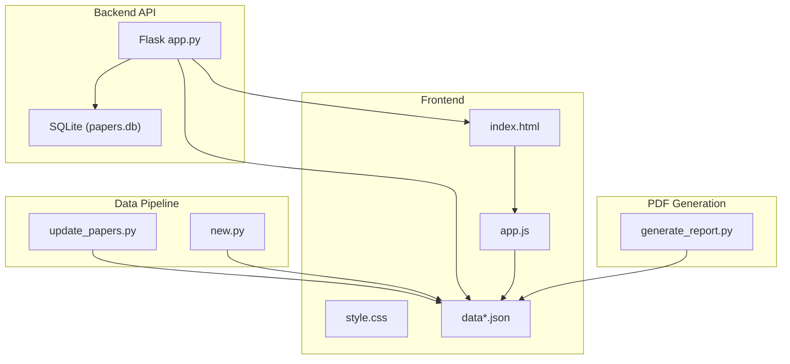
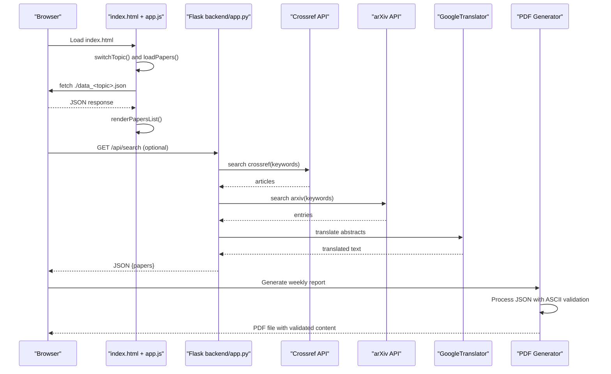
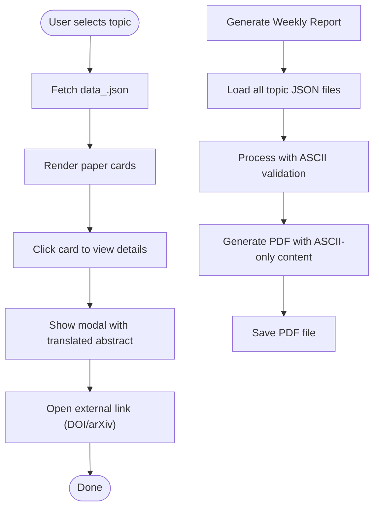
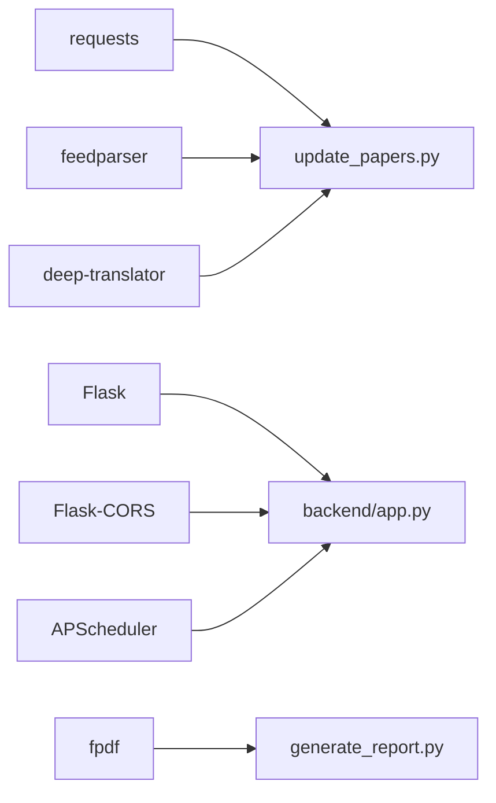

# Core Components

<cite>
**Referenced Files in This Document**
- [update_papers.py](file://update_papers.py)
- [generate_report.py](file://generate_report.py)
- [backend/app.py](file://backend/app.py)
- [index.html](file://index.html)
- [app.js](file://app.js)
- [style.css](file://style.css)
- [data.json](file://data.json)
- [data_cryo.json](file://data_cryo.json)
- [data_das.json](file://data_das.json)
- [data_imaging.json](file://data_imaging.json)
- [requirements.txt](file://requirements.txt)
- [README.md](file://README.md)
- [new.py](file://new.py)
</cite>

## Update Summary
**Changes Made**
- Updated PDF generation section to reflect ASCII-only character processing improvements
- Added documentation for enhanced abstract text validation in PDF reports
- Updated topic classification terminology to English-only interface
- Enhanced translation service documentation with improved validation
- Updated data processing pipeline with ASCII character filtering

## Table of Contents
1. [Introduction](#introduction)
2. [Project Structure](#project-structure)
3. [Core Components](#core-components)
4. [Architecture Overview](#architecture-overview)
5. [Detailed Component Analysis](#detailed-component-analysis)
6. [Dependency Analysis](#dependency-analysis)
7. [Performance Considerations](#performance-considerations)
8. [Troubleshooting Guide](#troubleshooting-guide)
9. [Conclusion](#conclusion)
10. [Appendices](#appendices)

## Introduction
This document explains the core components of the paper_weekly system, focusing on:
- The Python backend script that integrates APIs, processes data, translates content, and generates JSON for the frontend.
- The web frontend architecture including HTML structure, JavaScript for dynamic content loading, and CSS styling.
- Component interactions, data models for paper representation, and the modular design supporting multiple seismology topics.
- Practical integration patterns, configuration parameters, and user interaction behaviors.

**Updated** The system now includes enhanced PDF generation capabilities with ASCII-only character processing, English-only interface consistency, and improved abstract text validation for reliable report generation.

The system is designed to automatically collect recent papers from high-impact journals and arXiv, translate abstracts, validate text content, and present them in a responsive, topic-filtered web interface with robust PDF reporting capabilities.

## Project Structure
The repository organizes the system into:
- A Python data pipeline that scrapes, filters, translates, validates, and writes JSON files for each topic.
- A lightweight Flask backend that serves the frontend and exposes a simple API for fetching and analyzing papers.
- A static frontend with HTML, CSS, and JavaScript that renders topic-specific paper lists and modals.
- A PDF generation module that creates weekly reports with ASCII-only character processing and enhanced validation.

**Diagram sources**
- [update_papers.py:126-149](file://update_papers.py#L126-L149)
- [new.py:162-181](file://new.py#L162-L181)
- [backend/app.py:12-13](file://backend/app.py#L12-L13)
- [index.html:1-50](file://index.html#L1-L50)
- [app.js:1-148](file://app.js#L1-L148)
- [style.css:1-179](file://style.css#L1-L179)
- [data_cryo.json:1-5](file://data_cryo.json#L1-L5)
- [data_imaging.json:1-171](file://data_imaging.json#L1-L171)
- [generate_report.py:55-116](file://generate_report.py#L55-L116)

**Section sources**
- [README.md:33-36](file://README.md#L33-L36)

## Core Components
- Python data pipeline (update_papers.py): Defines topic configurations, searches Crossref and arXiv, cleans and translates abstracts, validates text content, and writes topic-specific JSON files.
- Flask backend (backend/app.py): Initializes a database, exposes endpoints to search and fetch papers, and performs on-demand translations and analysis.
- Frontend (index.html, app.js, style.css): Renders topic navigation, loads JSON data dynamically, displays cards, and shows a modal with translated abstracts and links.
- PDF generation (generate_report.py): Creates weekly paper reports with ASCII-only character processing, enhanced abstract validation, and English-only interface.

Key responsibilities:
- API integration: Crossref and arXiv via HTTP requests and feedparser.
- Data processing: Cleaning XML/HTML tags, translating text, validating abstracts, and structuring paper records.
- JSON generation: Producing topic-scoped JSON with metadata and translated abstracts.
- Frontend rendering: Dynamic loading, modal presentation, and responsive styling.
- PDF generation: Creating reports with ASCII character filtering and enhanced validation.

**Section sources**
- [update_papers.py:14-45](file://update_papers.py#L14-L45)
- [update_papers.py:72-124](file://update_papers.py#L72-L124)
- [generate_report.py:55-116](file://generate_report.py#L55-L116)
- [backend/app.py:29-49](file://backend/app.py#L29-L49)
- [backend/app.py:179-218](file://backend/app.py#L179-L218)
- [index.html:16-44](file://index.html#L16-L44)
- [app.js:42-92](file://app.js#L42-L92)
- [style.css:31-179](file://style.css#L31-L179)

## Architecture Overview
The system follows a client-server architecture with enhanced PDF generation capabilities:
- Backend server (Flask) serves static HTML and JSON data, and exposes endpoints for paper search and analysis.
- Frontend loads topic-specific JSON files and renders interactive cards and modals.
- Data pipeline runs periodically to refresh JSON files with validated abstract content.
- PDF generation module processes JSON data to create weekly reports with ASCII-only character filtering.

**Diagram sources**
- [index.html:13-16](file://index.html#L13-L16)
- [app.js:27-71](file://app.js#L27-L71)
- [backend/app.py:179-188](file://backend/app.py#L179-L188)
- [backend/app.py:29-49](file://backend/app.py#L29-L49)
- [backend/app.py:142-147](file://backend/app.py#L142-L147)
- [generate_report.py:55-116](file://generate_report.py#L55-L116)

## Detailed Component Analysis

### Python Data Pipeline (update_papers.py)
Responsibilities:
- Topic configuration with keywords and output filenames.
- Crossref search with journal filters and publication date sorting.
- arXiv search using feedparser.
- Text cleaning and translation using GoogleTranslator.
- Abstract validation and enhancement for downstream processing.
- JSON file generation with last update timestamp, topic name, and paper list.

Key functions and parameters:
- clean_abstract: Removes XML tags and standard prefixes from raw abstracts, ensuring consistent text format.
- translate_text: Translates text with length limits and fallback handling, returning validated Chinese translations.
- search_crossref: Builds query with topic keywords, filters by selected journals, sorts by publication date, and extracts metadata and translated abstracts.
- search_arxiv: Queries arXiv API, parses entries, and builds paper records with translated abstracts.
- Main loop: Iterates topics, merges results, sorts by publication date, and writes JSON files with enhanced validation.

Integration patterns:
- Uses requests and feedparser for API access.
- Uses deep_translator for translation.
- Writes JSON files in the repository root for the frontend to consume.
- Implements enhanced abstract validation for downstream PDF processing.

**Section sources**
- [update_papers.py:14-45](file://update_papers.py#L14-L45)
- [update_papers.py:54-71](file://update_papers.py#L54-L71)
- [update_papers.py:72-102](file://update_papers.py#L72-L102)
- [update_papers.py:104-124](file://update_papers.py#L104-L124)
- [update_papers.py:126-149](file://update_papers.py#L126-L149)

### PDF Generation Module (generate_report.py)
**Updated** New component for creating weekly paper reports with enhanced character processing and validation.

Responsibilities:
- Load paper data from all topic JSON files.
- Generate weekly PDF reports with ASCII-only character processing.
- Validate abstract text content for reliable PDF generation.
- Create structured reports with topic categorization and author information.
- Implement fallback font handling for better Unicode support.

Key features:
- ASCII-only character filtering: Abstracts are processed to remove non-ASCII characters for reliable PDF rendering.
- Enhanced validation: Checks for minimum abstract length and handles empty or invalid content gracefully.
- Topic grouping: Organizes papers by topic categories for structured reporting.
- Font fallback: Attempts to use DejaVu fonts for better Unicode support, falls back to Arial if unavailable.

Processing pipeline:
- Loads papers from data_cryo.json, data_das.json, data_surface.json, data_imaging.json, data_earthquake.json, and data_ai.json.
- Groups papers by topic and limits to 5 papers per topic.
- Processes abstracts to extract first 200 characters and convert to ASCII-only format.
- Generates PDF with proper headers, footers, and formatted content.

**Section sources**
- [generate_report.py:1-129](file://generate_report.py#L1-L129)

### Flask Backend (backend/app.py)
Responsibilities:
- Initialize SQLite database with a papers table.
- Expose endpoints for searching arXiv, fetching all papers, fetching a single paper, and triggering analysis.
- Translate abstracts and generate analysis summaries on demand.
- Schedule periodic arXiv searches weekly.

Endpoints:
- GET /: serves index.html from the frontend folder.
- POST /api/search: accepts keywords and max_results, searches arXiv, saves to DB, returns JSON.
- GET /api/papers: returns all papers from DB ordered by publication date.
- GET /api/paper/<paper_id>: returns a paper; if missing translated_abstract, triggers analysis and updates DB.
- POST /api/analyze/<paper_id>: forces analysis and returns updated paper.

Data model:
- Papers table includes id, title, abstract, authors, published, updated, categories, and extended fields for analysis and metadata.

**Section sources**
- [backend/app.py:17-27](file://backend/app.py#L17-L27)
- [backend/app.py:29-49](file://backend/app.py#L29-L49)
- [backend/app.py:66-95](file://backend/app.py#L66-L95)
- [backend/app.py:97-126](file://backend/app.py#L97-L126)
- [backend/app.py:128-173](file://backend/app.py#L128-L173)
- [backend/app.py:179-218](file://backend/app.py#L179-L218)
- [backend/app.py:219-236](file://backend/app.py#L219-L236)

### Frontend Architecture (index.html, app.js, style.css)
HTML structure:
- Header with title and description.
- Topic navigation buttons mapped to topic keys.
- Information bar showing current topic and last update.
- Loading indicator and empty state handling.
- Papers list container and a modal for detailed views.

JavaScript functionality:
- Topic switching updates active button and loads the corresponding JSON file.
- Async fetch of data_<topic>.json, error handling, and rendering of paper cards.
- Modal display with author info, translated abstract preview, and external link.
- Utility to escape HTML for safe rendering.

CSS styling:
- Responsive layout with centered container and flexible topic buttons.
- Card hover effects, modal overlay, spinner animation, and hidden state toggles.
- Theme variables for primary color and backgrounds.

**Section sources**
- [index.html:16-44](file://index.html#L16-L44)
- [app.js:27-71](file://app.js#L27-L71)
- [app.js:73-92](file://app.js#L73-L92)
- [app.js:94-127](file://app.js#L94-L127)
- [style.css:31-179](file://style.css#L31-L179)

### Data Models and JSON Schema
Paper representation:
- Fields include id, title, url, first_author, corr_author, affiliation, abs_zh (translated abstract), source, published, and topic-specific metadata.
- Additional analysis fields (summary, first_author, corresponding_author, affiliation, translated_abstract, importance, related_work, methods, innovation) are stored in the backend database.

Topic-scoped JSON structure:
- last_update: Timestamp range for the collected papers.
- topic_name: Human-readable topic label.
- papers: Array of paper objects with cleaned and translated abstracts.

**Updated** Topic classifications now use English terminology consistently across the system, with Chinese topic names preserved in the JSON structure while maintaining English interface standards.

Example references:
- Topic JSON files for cryo and imaging topics.
- Example paper entry with translated abstract and metadata.

**Section sources**
- [data_cryo.json:1-5](file://data_cryo.json#L1-L5)
- [data_imaging.json:1-171](file://data_imaging.json#L1-L171)
- [data.json:1-442](file://data.json#L1-L442)

### Component Interactions
- Frontend loads topic JSON files and renders cards.
- Backend serves JSON files and exposes endpoints for dynamic search and analysis.
- Translation service is invoked either by the data pipeline or backend depending on the flow.
- PDF generation module processes JSON data to create weekly reports with ASCII-only character filtering.

**Diagram sources**
- [app.js:42-92](file://app.js#L42-L92)
- [app.js:94-127](file://app.js#L94-L127)
- [generate_report.py:55-116](file://generate_report.py#L55-L116)

## Dependency Analysis
External libraries and their roles:
- requests: HTTP client for Crossref and arXiv APIs.
- feedparser: Parses arXiv Atom feeds.
- deep-translator: Provides translation service for abstracts.
- flask, flask-cors: Web framework and CORS support.
- apscheduler: Background job scheduling for periodic searches.
- fpdf: PDF generation library for weekly report creation.

**Updated** Added fpdf dependency for PDF generation capabilities with enhanced character processing.

**Diagram sources**
- [requirements.txt:1-7](file://requirements.txt#L1-L7)
- [update_papers.py:1-10](file://update_papers.py#L1-L10)
- [backend/app.py:1-11](file://backend/app.py#L1-L11)
- [generate_report.py:10](file://generate_report.py#L10)

**Section sources**
- [requirements.txt:1-7](file://requirements.txt#L1-L7)

## Performance Considerations
- API rate limiting: Respect Crossref and arXiv rate limits; consider delays between requests.
- Translation costs: Frequent translations can incur rate limits or throttling; cache translated results when feasible.
- Rendering performance: Large paper lists can impact DOM rendering; virtualization or pagination can help.
- Network latency: Prefetching JSON files and caching can improve perceived performance.
- Database operations: Batch inserts and indexing can reduce write overhead.
- **Updated** PDF generation performance: ASCII character filtering adds minimal overhead but ensures reliable PDF rendering across different systems.

## Troubleshooting Guide
Common issues and remedies:
- Translation failures: The translation function includes fallback text; verify network connectivity and API quotas.
- Empty topic data: Ensure the data_<topic>.json files exist and are readable by the frontend.
- CORS errors: Confirm Flask-CORS is enabled and configured for the frontend origin.
- Backend startup: Verify database initialization and scheduler configuration.
- **Updated** PDF generation issues: Check font availability for DejaVu fonts; system falls back to Arial if fonts are not available.
- **Updated** ASCII character processing: Verify that abstract text processing is working correctly; check for encoding issues in downloaded content.

**Section sources**
- [update_papers.py:63-71](file://update_papers.py#L63-L71)
- [backend/app.py:12-13](file://backend/app.py#L12-L13)
- [backend/app.py:225-236](file://backend/app.py#L225-L236)
- [generate_report.py:62-67](file://generate_report.py#L62-L67)

## Conclusion
The paper_weekly system integrates multiple data sources, applies translation and analysis, and presents a responsive, topic-filtered interface. The modular design allows easy extension to additional topics and data sources. The backend provides a simple API for dynamic operations, while the frontend focuses on fast, user-friendly interaction. **Updated** The addition of PDF generation capabilities with ASCII-only character processing and enhanced abstract validation ensures reliable report creation across different environments and platforms.

## Appendices

### API Definitions
- POST /api/search
  - Request body: { keywords: string[], max_results: number }
  - Response: { papers: Paper[] }
- GET /api/papers
  - Response: { papers: Paper[] }
- GET /api/paper/{paper_id}
  - Response: { paper: Paper }
- POST /api/analyze/{paper_id}
  - Response: { paper: Paper }

**Section sources**
- [backend/app.py:179-218](file://backend/app.py#L179-L218)

### Configuration Options
- Topic configuration keys: name, name_zh, keywords, file.
- Journal filters: curated list of high-impact journals.
- Translation parameters: target language and text length limits.
- **Updated** PDF generation parameters: ASCII character filtering, font fallback options, and abstract validation thresholds.

**Section sources**
- [update_papers.py:14-45](file://update_papers.py#L14-L45)
- [update_papers.py:47-52](file://update_papers.py#L47-L52)
- [update_papers.py:63-71](file://update_papers.py#L63-L71)
- [generate_report.py:102-110](file://generate_report.py#L102-L110)

### User Interaction Patterns
- Topic switching: Buttons trigger JSON reload and update UI state.
- Card click: Opens modal with translated abstract and external link.
- Loading states: Spinner indicates asynchronous data fetch.
- **Updated** PDF generation: Users can generate weekly reports with validated content and ASCII-only character processing.

**Section sources**
- [index.html:16-44](file://index.html#L16-L44)
- [app.js:27-71](file://app.js#L27-L71)
- [app.js:94-127](file://app.js#L94-L127)
- [generate_report.py:118-129](file://generate_report.py#L118-L129)

### PDF Generation Features
**New Section** Enhanced PDF generation capabilities with ASCII-only character processing and validation.

- Automatic weekly report generation
- ASCII-only character filtering for reliable PDF rendering
- Enhanced abstract text validation with minimum length checks
- Topic-based organization with structured formatting
- Font fallback support for international character sets
- Error handling for empty or invalid abstract content

**Section sources**
- [generate_report.py:55-116](file://generate_report.py#L55-L116)