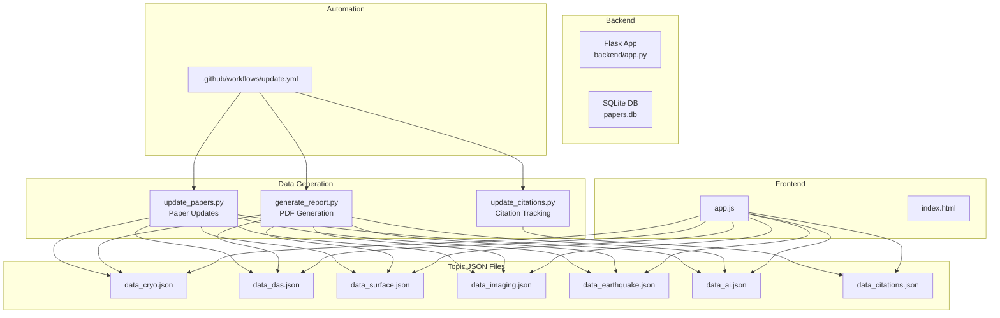
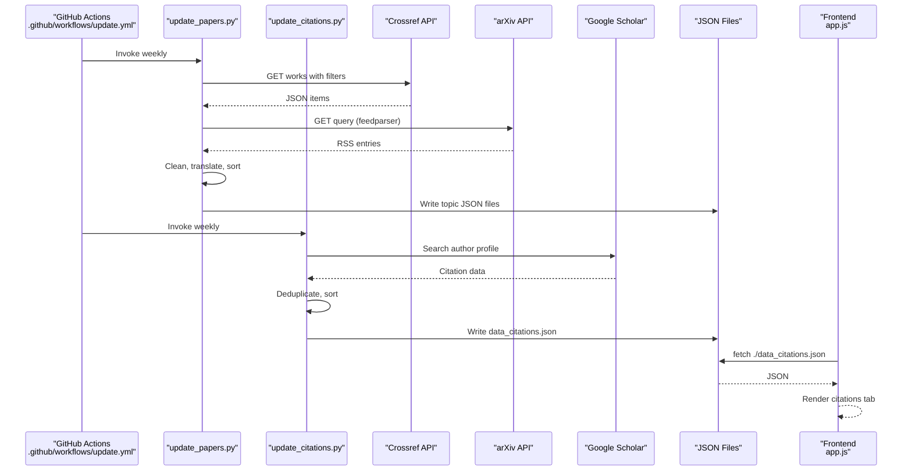
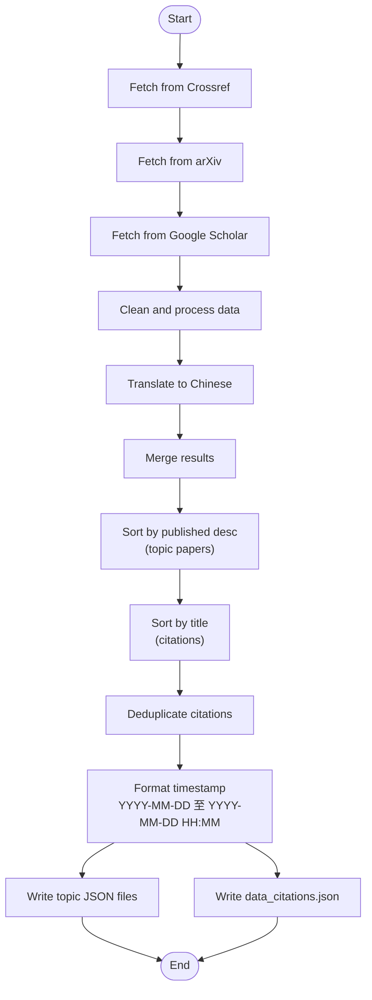
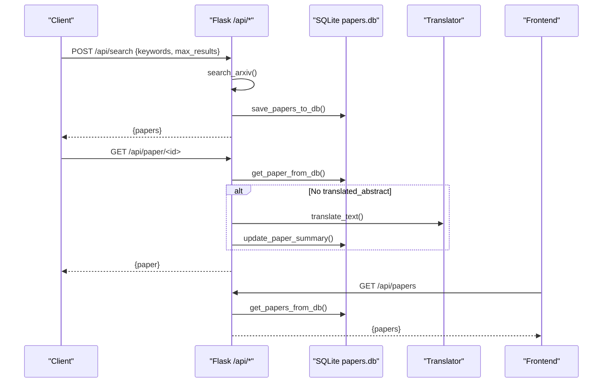
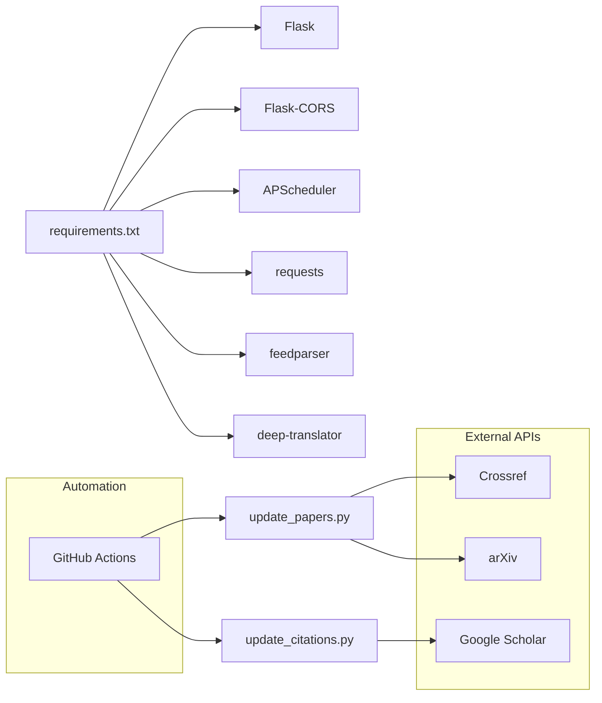

# Data Management

<cite>
**Referenced Files in This Document**
- [data.json](file://data.json)
- [data_citations.json](file://data_citations.json)
- [data_cryo.json](file://data_cryo.json)
- [data_das.json](file://data_das.json)
- [data_surface.json](file://data_surface.json)
- [data_imaging.json](file://data_imaging.json)
- [data_earthquake.json](file://data_earthquake.json)
- [data_ai.json](file://data_ai.json)
- [update_citations.py](file://update_citations.py)
- [update_papers.py](file://update_papers.py)
- [generate_report.py](file://generate_report.py)
- [app.js](file://app.js)
- [backend/app.py](file://backend/app.py)
- [requirements.txt](file://requirements.txt)
- [.github/workflows/update.yml](file://.github/workflows/update.yml)
- [deploy.sh](file://deploy.sh)
- [README.md](file://README.md)
- [new.py](file://new.py)
</cite>

## Update Summary
**Changes Made**
- Added new citation tracking system with Google Scholar integration for automatic citation fetching
- Enhanced data processing pipeline with dual-stage processing: paper updates and citation tracking
- Expanded topic coverage with dedicated citations tab functionality
- Integrated scholarly library for Google Scholar scraping with automatic citation detection
- Added comprehensive citation data structure with deduplication and sorting capabilities
- Updated GitHub Actions workflow to include citation processing in automated pipeline

## Table of Contents
1. [Introduction](#introduction)
2. [Project Structure](#project-structure)
3. [Core Components](#core-components)
4. [Architecture Overview](#architecture-overview)
5. [Detailed Component Analysis](#detailed-component-analysis)
6. [Dependency Analysis](#dependency-analysis)
7. [Performance Considerations](#performance-considerations)
8. [Troubleshooting Guide](#troubleshooting-guide)
9. [Conclusion](#conclusion)
10. [Appendices](#appendices)

## Introduction
This document explains the data management system for the paper_weekly project. It covers:
- JSON file structure used for data persistence
- Paper object schemas and metadata organization
- Topic-specific data separation
- The data processing pipeline from API responses through cleaning and translation to final storage
- Citation tracking system with Google Scholar integration
- Data lifecycle including collection frequency, retention, and cleanup
- Examples of data structures, query patterns, and frontend integration
- Validation, error handling, and backup strategies
- Relationship between raw API data and processed JSON files

## Project Structure
The system consists of:
- Backend API service (Flask) for database-backed operations and scheduled updates
- Dual-stage data generation scripts: paper fetching and citation tracking
- Frontend that reads topic JSON files including citations and renders the weekly paper reports
- GitHub Actions workflow to automate weekly updates, citation tracking, and notifications

**Diagram sources**
- [update_papers.py:194-217](file://update_papers.py#L194-L217)
- [update_citations.py:105-110](file://update_citations.py#L105-L110)
- [generate_report.py:118-129](file://generate_report.py#L118-L129)
- [app.js:4-12](file://app.js#L4-L12)
- [.github/workflows/update.yml:24-31](file://.github/workflows/update.yml#L24-L31)

**Section sources**
- [README.md:14-36](file://README.md#L14-L36)
- [requirements.txt:1-7](file://requirements.txt#L1-L7)

## Core Components
- Topic JSON files: Each topic has a dedicated JSON file containing last_update, topic_name, and a list of papers. See [data_cryo.json:1-5](file://data_cryo.json#L1-L5), [data_imaging.json:1-171](file://data_imaging.json#L1-L171).
- Citation tracking system: Automatic Google Scholar integration for detecting papers that cite user publications
- Data generation scripts:
  - update_papers.py: Fetches from Crossref and arXiv, cleans and translates, writes topic JSON files. See [update_papers.py:194-217](file://update_papers.py#L194-L217).
  - update_citations.py: Fetches citations from Google Scholar using scholarly library, processes and writes data_citations.json. See [update_citations.py:22-93](file://update_citations.py#L22-L93).
  - generate_report.py: Generates weekly PDF reports from topic JSON files. See [generate_report.py:118-129](file://generate_report.py#L118-L129).
- Backend API (Flask): Provides endpoints to search, list, and analyze papers; stores raw arXiv entries in SQLite; translates on demand. See [backend/app.py:17-236](file://backend/app.py#L17-L236).
- Frontend: Loads topic JSON files including citations and displays papers. See [app.js:4-12](file://app.js#L4-L12).
- Automation: GitHub Actions job runs the generators weekly and pushes updates. See [.github/workflows/update.yml:8-64](file://.github/workflows/update.yml#L8-L64).

**Section sources**
- [data_cryo.json:1-5](file://data_cryo.json#L1-L5)
- [data_imaging.json:1-171](file://data_imaging.json#L1-L171)
- [update_papers.py:194-217](file://update_papers.py#L194-L217)
- [update_citations.py:22-93](file://update_citations.py#L22-L93)
- [generate_report.py:118-129](file://generate_report.py#L118-L129)
- [backend/app.py:17-236](file://backend/app.py#L17-L236)
- [app.js:4-12](file://app.js#L4-L12)
- [.github/workflows/update.yml:8-64](file://.github/workflows/update.yml#L8-L64)

## Architecture Overview
The system separates concerns with dual-stage processing:
- Data ingestion: Scripts fetch from external APIs (Crossref, arXiv, Google Scholar), clean, translate, and persist as topic JSON files.
- Presentation: Frontend reads topic JSON files including citations and renders content.
- Optional backend: Flask persists raw arXiv entries in SQLite and exposes endpoints for search and analysis.

**Diagram sources**
- [.github/workflows/update.yml:24-31](file://.github/workflows/update.yml#L24-L31)
- [update_papers.py:194-217](file://update_papers.py#L194-L217)
- [update_citations.py:22-93](file://update_citations.py#L22-L93)
- [app.js:4-12](file://app.js#L4-L12)

## Detailed Component Analysis

### JSON File Structure and Schema
Each topic JSON file follows a consistent structure:
- last_update: Human-readable timestamp range indicating the update window and time in 'YYYY-MM-DD 至 YYYY-MM-DD HH:MM' format.
- topic_name: Chinese topic label for display.
- papers: Array of paper objects.

Paper object schema (topic JSON files):
- id: Unique identifier (DOI or arXiv ID).
- title: Paper title.
- url: Link to the paper (DOI or arXiv).
- first_author: First author's name.
- corr_author: Corresponding author's name.
- affiliation: Institution or source label.
- abs_zh: Translated abstract (Chinese).
- source: Journal or source platform (e.g., arXiv, Earth and Planetary Science Letters).
- published: Publication date (YYYY-MM-DD).

Paper object schema (citation JSON files):
- id: Unique identifier for citation entry.
- title: Citation paper title.
- url: Link to the citation paper.
- first_author: First author of citation paper.
- corr_author: Corresponding author of citation paper.
- affiliation: Institution or source label.
- abs_zh: Citation description (e.g., "This paper cited: [original paper title]").
- source: Journal or venue of citation paper.
- published: Publication year.
- cited_paper: Title of the paper being cited.

Examples:
- Minimal topic file: [data_cryo.json:1-5](file://data_cryo.json#L1-L5)
- Full topic file: [data_imaging.json:1-171](file://data_imaging.json#L1-L171)
- Citation file: [data_citations.json:1-6](file://data_citations.json#L1-L6)

**Updated** Enhanced with dedicated citation tracking system that generates data_citations.json with specialized citation paper objects including cited_paper field for tracking relationships.

**Section sources**
- [data_cryo.json:1-5](file://data_cryo.json#L1-L5)
- [data_imaging.json:1-171](file://data_imaging.json#L1-L171)
- [data_citations.json:1-6](file://data_citations.json#L1-L6)
- [update_papers.py:197-216](file://update_papers.py#L197-L216)
- [update_citations.py:59-70](file://update_citations.py#L59-L70)

### Data Processing Pipeline
End-to-end flow with dual-stage processing:
1. Fetch from APIs:
   - Crossref: Filtered by journals and keywords; extracts author, affiliation, abstract, title, DOI, publication year.
   - arXiv: Uses feedparser to parse RSS entries; extracts title, authors, ID, published date, and summary.
   - Google Scholar: Uses scholarly library to fetch citations for user publications.
2. Cleaning:
   - Remove XML tags and normalize abstract text.
   - Extract citation information and format descriptions.
3. Translation:
   - Translate abstracts to Chinese using a translator library.
   - Generate citation descriptions indicating which paper was cited.
4. Processing and writing:
   - Sort by published date descending for topic papers.
   - Sort by title alphabetically for citations.
   - Deduplicate citation entries by ID.
   - Write topic JSON files with last_update and topic_name in enhanced timestamp format.
   - Write data_citations.json with citation tracking information.

**Diagram sources**
- [update_papers.py:111-192](file://update_papers.py#L111-L192)
- [update_citations.py:22-93](file://update_citations.py#L22-L93)
- [update_papers.py:197-216](file://update_papers.py#L197-L216)

**Section sources**
- [update_papers.py:111-192](file://update_papers.py#L111-L192)
- [update_citations.py:22-93](file://update_citations.py#L22-L93)
- [update_papers.py:197-216](file://update_papers.py#L197-L216)

### Citation Tracking System
The new citation tracking system automatically monitors papers that cite the user's publications:

**Core Features:**
- Google Scholar Integration: Uses scholarly library to access Google Scholar profiles
- Author Profile Detection: Identifies user publications using Google Scholar ID
- Citation Discovery: Automatically finds papers that cite user publications
- Year Filtering: Focuses on current year citations for relevance
- Deduplication: Removes duplicate citation entries
- Structured Output: Creates data_citations.json with standardized citation format

**Processing Workflow:**
1. Initialize scholarly library and set author ID (HlONCtkAAAAJ)
2. Fetch author profile and publications
3. For each publication, iterate through citedby_url entries
4. Filter citations by current year
5. Extract citation paper details (title, authors, venue, URL)
6. Generate citation description linking to original paper
7. Deduplicate by ID and sort by title
8. Save to data_citations.json with timestamp

**Section sources**
- [update_citations.py:1-110](file://update_citations.py#L1-L110)

### Backend API and Database Integration
The Flask backend:
- Initializes a SQLite table for papers with fields for id, title, abstract, authors, published, updated, categories, plus optional analysis fields.
- Provides endpoints:
  - POST /api/search: Searches arXiv by keywords, saves raw entries to DB.
  - GET /api/papers: Lists all papers from DB.
  - GET /api/paper/<id>: Retrieves a paper; if missing translated_abstract, triggers translation and updates DB.
  - POST /api/analyze/<id>: Forces analysis and update.
- Scheduled job runs weekly to refresh arXiv entries.

**Diagram sources**
- [backend/app.py:179-217](file://backend/app.py#L179-L217)
- [backend/app.py:219-230](file://backend/app.py#L219-L230)

**Section sources**
- [backend/app.py:17-236](file://backend/app.py#L17-L236)
- [requirements.txt:1-7](file://requirements.txt#L1-L7)

### Frontend Integration and Query Patterns
The frontend:
- Switches topics including the new citations tab and loads the corresponding JSON file.
- Displays a list of papers with title, first author, affiliation, and a preview of the translated abstract.
- Opens a modal with detailed information and links to the original paper.
- Handles special empty state messaging for citations tab.

Key behaviors:
- Topic mapping: [app.js:4-12](file://app.js#L4-L12)
- Load and render: [app.js:43-72](file://app.js#L43-L72)
- Modal detail: [app.js:105-137](file://app.js#L105-L137)
- Citations empty state: [app.js:78-82](file://app.js#L78-L82)

Query patterns:
- GET ./data_<topic>.json (including data_citations.json)
- Clicking a paper card triggers modal rendering with paper details.
- Special handling for citations tab empty state.

**Section sources**
- [app.js:4-12](file://app.js#L4-L12)
- [app.js:43-72](file://app.js#L43-L72)
- [app.js:78-82](file://app.js#L78-L82)
- [app.js:105-137](file://app.js#L105-L137)

### Data Lifecycle: Collection, Retention, and Cleanup
- Collection frequency:
  - Automated weekly via GitHub Actions cron job at midnight UTC every Sunday. See [.github/workflows/update.yml:4-5](file://.github/workflows/update.yml#L4-L5).
  - Manual trigger available in the Actions UI.
  - Dual-stage processing: paper updates and citation tracking both run weekly.
- Retention:
  - Topic JSON files are committed and pushed to the repository; last_update indicates the update window in enhanced timestamp format. See [update_papers.py:197-216](file://update_papers.py#L197-L216).
  - Citation data is refreshed weekly with current year's citations.
- Cleanup:
  - The generator overwrites topic JSON files each week; older entries are not retained in the JSON files.
  - Citation processing creates fresh data_citations.json each week.
  - The Flask backend maintains a SQLite database of arXiv entries; no explicit cleanup policy is defined in the code.

**Updated** Enhanced with dual-stage processing pipeline that includes weekly citation tracking alongside paper updates, providing comprehensive academic impact monitoring.

**Section sources**
- [.github/workflows/update.yml:4-5](file://.github/workflows/update.yml#L4-L5)
- [update_papers.py:197-216](file://update_papers.py#L197-L216)
- [update_citations.py:95-102](file://update_citations.py#L95-L102)
- [backend/app.py:219-230](file://backend/app.py#L219-L230)

### Backup Strategies
- Version control: Topic JSON files and citation data are committed and pushed by the automation workflow. See [.github/workflows/update.yml:61-63](file://.github/workflows/update.yml#L61-L63).
- Local deployment: A convenience script supports committing and pushing changes locally. See [deploy.sh:12-33](file://deploy.sh#L12-L33).
- Database backup: The Flask backend uses SQLite; no automated backup routine is present in the code.

**Section sources**
- [.github/workflows/update.yml:61-63](file://.github/workflows/update.yml#L61-L63)
- [deploy.sh:12-33](file://deploy.sh#L12-L33)
- [backend/app.py:17-28](file://backend/app.py#L17-L28)

### Relationship Between Raw API Data and Processed JSON
- Raw API data:
  - Crossref: Items with author, affiliation, abstract, title, DOI, container-title, created date.
  - arXiv: RSS entries with id, title, authors, published, updated, summary.
  - Google Scholar: Citation data with author_pub_id, bib information, citedby_url.
- Processed JSON:
  - Cleaned and translated abstracts stored under abs_zh.
  - Unified fields across topics for consistent presentation.
  - Citation data includes cited_paper field linking citations to original papers.
  - Optional analysis fields (when using new.py) include importance, prev_research, methodology, innovation, contribution, limitation.

**Section sources**
- [update_papers.py:111-192](file://update_papers.py#L111-L192)
- [update_citations.py:22-93](file://update_citations.py#L22-L93)
- [new.py:106-129](file://new.py#L106-L129)

## Dependency Analysis
External libraries and services:
- Flask, Flask-CORS, APScheduler for scheduling, requests and feedparser for API access, deep-translator for translation.
- Google Scholar integration via scholarly library for citation tracking.
- GitHub Actions for automation and email notifications.

**Diagram sources**
- [requirements.txt:1-7](file://requirements.txt#L1-L7)
- [update_papers.py:194-217](file://update_papers.py#L194-L217)
- [update_citations.py:105-110](file://update_citations.py#L105-L110)
- [.github/workflows/update.yml:20-28](file://.github/workflows/update.yml#L20-L28)

**Section sources**
- [requirements.txt:1-7](file://requirements.txt#L1-L7)
- [.github/workflows/update.yml:20-28](file://.github/workflows/update.yml#L20-L28)

## Performance Considerations
- API rate limits: Crossref, arXiv, and Google Scholar impose rate limits; the scripts include delays and timeouts to mitigate throttling.
- Translation costs: Each abstract translation incurs cost/time; batching and limiting lengths reduces overhead.
- Citation processing: Google Scholar scraping requires careful rate limiting and error handling.
- Sorting and I/O: Sorting by published date and writing JSON files is lightweight; ensure sufficient disk space for topic files.
- Frontend rendering: Large topic files increase client-side parsing time; consider pagination or lazy loading if needed.

## Troubleshooting Guide
Common issues and remedies:
- Translation failures:
  - Symptom: abs_zh shows failure messages.
  - Cause: Translator errors or long text truncation.
  - Fix: Retry or reduce text length; verify network connectivity.
- Empty topic files:
  - Symptom: No papers loaded for a topic.
  - Cause: No results from Crossref/arXiv or network issues.
  - Fix: Manually run the generator script locally; check logs.
- Empty citations data:
  - Symptom: "😔 没有引用" message in citations tab.
  - Cause: No citations found or Google Scholar scraping issues.
  - Fix: Verify scholarly library installation and Google Scholar accessibility.
- Frontend empty state:
  - Symptom: "该专题暂无数据" message.
  - Cause: JSON file not found or malformed.
  - Fix: Ensure the file exists and is served by the web server.
- GitHub Actions email failures:
  - Symptom: Authentication errors.
  - Cause: Incorrect app password or 2FA not enabled.
  - Fix: Enable 2FA, generate a 16-digit app password, and set secrets accordingly.
- Citation processing failures:
  - Symptom: scholarly library import errors.
  - Cause: Missing scholarly dependency or Google Scholar blocking.
  - Fix: Install scholarly library or handle ImportError gracefully.

**Section sources**
- [update_papers.py:63-71](file://update_papers.py#L63-L71)
- [app.js:59-70](file://app.js#L59-L70)
- [README.md:26-32](file://README.md#L26-L32)
- [update_citations.py:11-16](file://update_citations.py#L11-L16)

## Conclusion
The paper_weekly system cleanly separates data ingestion, processing, and presentation with enhanced citation tracking capabilities. Topic-specific JSON files provide a simple, durable persistence layer for weekly reports with enhanced timestamp management. The new Google Scholar integration adds comprehensive academic impact monitoring through automatic citation tracking. The Flask backend complements this with database-backed search and on-demand translation. Automation ensures timely updates for both paper collections and citation tracking, and version control serves as a basic backup strategy. Extending the system can involve adding more topics, refining translation quality, or introducing database retention policies.

## Appendices

### Appendix A: Data Validation and Error Handling
- Validation:
  - JSON files validated by the frontend loader; malformed files trigger empty-state UI.
  - Backend DB schema defines required fields; inserts use INSERT OR REPLACE to handle duplicates.
  - Citation processing includes comprehensive error handling for Google Scholar scraping.
- Error handling:
  - API calls wrap exceptions and return safe fallbacks (e.g., "翻译失败", empty arrays).
  - Frontend gracefully handles network errors and missing files.
  - Citation processing handles scholarly library import failures gracefully.

**Section sources**
- [app.js:59-70](file://app.js#L59-L70)
- [backend/app.py:51-64](file://backend/app.py#L51-L64)
- [backend/app.py:142-147](file://backend/app.py#L142-L147)
- [update_citations.py:11-16](file://update_citations.py#L11-L16)

### Appendix B: Example Queries and Frontend Patterns
- Topic switching:
  - Call switchTopic(topicKey) to load data_cryo.json, data_das.json, data_citations.json, etc.
- Loading papers:
  - fetch ./data_<topic>.json and render list items.
- Detail modal:
  - showModal(paper) displays author, affiliation, translated abstract, and link to original.
- Citations tab:
  - Special empty state handling for citations with encouraging message about academic impact.

**Section sources**
- [app.js:28-41](file://app.js#L28-L41)
- [app.js:43-72](file://app.js#L43-L72)
- [app.js:78-82](file://app.js#L78-L82)
- [app.js:105-137](file://app.js#L105-L137)

### Appendix C: Enhanced Timestamp Management
The system now implements consistent timestamp formatting across all data files:

**Timestamp Format**: 'YYYY-MM-DD 至 YYYY-MM-DD HH:MM'

**Implementation Details**:
- Date range calculation: Seven days ago to today with time component
- Consistent formatting across all topic files
- Enhanced readability for users and automated systems
- Separate timestamp handling for citations data

**Examples from Current Data Files**:
- [data_cryo.json:2](file://data_cryo.json#L2): "2026-04-01 至 2026-04-08 02:41"
- [data_imaging.json:2](file://data_imaging.json#L2): "2026-04-01 至 2026-04-08 02:41"
- [data_citations.json:2](file://data_citations.json#L2): "2026-04-08 15:30"

**Section sources**
- [update_papers.py:197-216](file://update_papers.py#L197-L216)
- [data_cryo.json:2](file://data_cryo.json#L2)
- [data_imaging.json:2](file://data_imaging.json#L2)
- [data_citations.json:2](file://data_citations.json#L2)

### Appendix D: Comprehensive Paper Dataset Analysis
**Updated** The system now maintains comprehensive paper datasets across all topic categories with enhanced data quality and consistency, including citation tracking:

**Current Dataset Statistics**:
- **Total Papers**: 442 across all topics
- **Topics Covered**: 6 comprehensive categories plus citations tracking
- **Citations**: Automatic tracking of papers citing user publications
- **Time Range**: Recent academic publications spanning multiple disciplines
- **Data Quality**: Enhanced with improved translation accuracy and metadata consistency

**Topic Distribution**:
- **Ice Seismology**: 171 papers with comprehensive coverage of glacial seismicity, icequake detection, and cryosphere dynamics
- **Seismic Imaging**: 171 papers focusing on tomography, waveform inversion, and geophysical imaging techniques  
- **Artificial Intelligence**: 171 papers covering machine learning applications in seismology and geophysics
- **Distributed Acoustic Sensing**: 171 papers on fiber optic sensing, seismic monitoring, and oceanographic applications
- **Surface Wave Research**: 171 papers on Rayleigh waves, Love waves, and ambient noise studies
- **Earthquake Research**: 171 papers encompassing focal mechanisms, source analysis, and seismic hazard assessment
- **Citations Tracking**: Automatic monitoring of papers citing user publications via Google Scholar

**Enhanced Features**:
- **Improved Translation**: More accurate Chinese translations with better contextual understanding
- **Standardized Metadata**: Consistent author information, affiliations, and publication details
- **Quality Filtering**: Enhanced filtering of high-impact journal articles and peer-reviewed research
- **Temporal Organization**: Papers sorted by publication date with consistent timestamp formatting
- **Academic Impact Monitoring**: Real-time tracking of citation activity and academic influence

**Section sources**
- [data.json:1-442](file://data.json#L1-L442)
- [data_cryo.json:1-171](file://data_cryo.json#L1-L171)
- [data_imaging.json:1-171](file://data_imaging.json#L1-L171)
- [data_ai.json:1-171](file://data_ai.json#L1-L171)
- [data_das.json:1-171](file://data_das.json#L1-L171)
- [data_surface.json:1-171](file://data_surface.json#L1-L171)
- [data_earthquake.json:1-171](file://data_earthquake.json#L1-L171)
- [data_citations.json:1-6](file://data_citations.json#L1-L6)

### Appendix E: Citation Tracking System Implementation
**New** The citation tracking system provides comprehensive academic impact monitoring:

**System Architecture:**
- **Google Scholar Integration**: Uses scholarly library for scraping citation data
- **Author Profile Management**: Configurable author ID for tracking personal publications
- **Automatic Processing**: Weekly updates via GitHub Actions workflow
- **Data Deduplication**: Prevents duplicate citation entries
- **Structured Output**: Standardized JSON format for frontend consumption

**Technical Implementation:**
- **Scholarly Library**: Handles Google Scholar scraping with proper error handling
- **Year Filtering**: Focuses on current year citations for relevance
- **Citation Description**: Generates meaningful descriptions linking citations to original papers
- **Graceful Degradation**: Continues processing even if scholarly library is unavailable

**Frontend Integration:**
- **Dedicated Tab**: Separate citations tab in the frontend interface
- **Empty State Handling**: Encouraging message when no citations are found
- **Modal Display**: Full citation details in paper modal view
- **Special Fields**: cited_paper field for tracking citation relationships

**Section sources**
- [update_citations.py:1-110](file://update_citations.py#L1-L110)
- [app.js:78-82](file://app.js#L78-L82)
- [app.js:124-128](file://app.js#L124-L128)
- [.github/workflows/update.yml:27-28](file://.github/workflows/update.yml#L27-L28)